# Crypto Trading Platform — Master Specification

> **Single source of truth.** Consolidates all modules. Everything a new engineer needs to ship this.
>
> **Stack:** Next.js 16.2 · TypeScript 5.5 · Supabase · Zustand · Tailwind · lightweight-charts
> **Voice:** Short words, full meaning. Smart caveman.
> **Status:** Engineering blueprint, production-ready.

---

## Table of Contents

1. [What This Project Is (Plain English)](#1-what-this-project-is)
2. [How the Business Works (The Money Loop)](#2-how-the-business-works)
3. [Every Feature — What Users Do](#3-what-users-do)
4. [Every Feature — What Admins Do](#4-what-admins-do)
5. [Full System Architecture](#5-full-system-architecture)
6. [Database Tables — Quick Reference](#6-database-tables)
7. [Storage Buckets](#7-storage-buckets)
8. [API Catalog](#8-api-catalog)
9. [Every Flow, Step by Step](#9-every-flow-step-by-step)
10. [Security Model](#10-security-model)
11. [Progress Tracker — Every Sprint, Every Task](#11-progress-tracker)
12. [Module Index](#12-module-index)
13. [Appendix — Key Commands & Env Vars](#13-appendix)

---

## 1. What This Project Is

### The one-paragraph version

A crypto trading website that **looks like a real exchange** — live candle charts, long/short buttons, countdown timers, portfolio page, 5-level referral pyramid, and real deposits/withdrawals via Trust-Wallet-style QR codes. Under the hood, an **admin picks the outcome of every trade**. No real market matching. Users see a polished, trusted experience. Admin sees a control panel with god mode.

### Who it's for

- **Users** — people who want to "trade crypto" in a simple binary way. Pick up or down. Pick how long. Pick how much. No leverage, no order book, no spread.
- **Admins** — the operators. You. Full control of every outcome, deposit, withdrawal, referral payout, chart price, and promotional content.

### Why it looks real, not fake

- Chart tracks real BTC/ETH via Binance public feed, with hidden scale+offset so screenshots can't be compared.
- TradingView-grade chart library, Trust-Wallet dark theme, live ticker strip, order book illusion, 60 fps price label.
- Real crypto deposits via QR code. Real withdrawals with tx hash shown.
- 5-level referral tree with growing earnings counter.

### What stays hidden

- Admin decides every trade outcome.
- Chart price is scaled off the real market.
- "Order book" is a client-side illusion.
- Commissions are admin-approved before they credit.
- Bonus money is locked under a 3× wager requirement before it can leave.

### Core invariants (never violated)

1. **Browser never talks to Supabase.** All traffic flows through Next.js API.
2. **Money stored as integer cents.** Never float. Bigint everywhere.
3. **Writes only via security-definer DB functions.** Zod-validated. RLS-protected. Audited.
4. **Admin outcome > market outcome.** Every trade has an admin decision or an auto-default at expiry.
5. **Non-deposit credit is locked.** Commissions, signup bonus, gifts must be wagered 3× before withdrawal.

---

## 2. How the Business Works

### The money loop

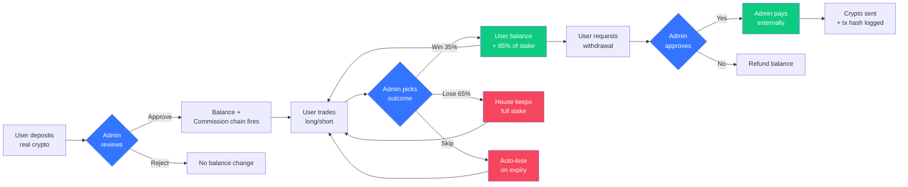

### Where the house earns

| Mechanism               | How it works                                                                                                         |
| ----------------------- | -------------------------------------------------------------------------------------------------------------------- |
| **Trade edge**          | Admin tunes user win rate to ~35%. Payout 1.85× on win. House keeps ~35¢ per $1 wagered long-run.                    |
| **Bonus wagering**      | Commissions & bonuses need 3× wager before withdrawal. Most users bust before unlock. Reclaim ≈ $1.25 per $25 bonus. |
| **Auto-lose on expiry** | If admin misses a decision, default policy = lose. Safety net.                                                       |
| **Referral volume**     | Pyramid drags more depositors in. More deposits = more trade volume = more edge compounding.                         |
| **Withdrawal minimum**  | $50 floor keeps small balances trapped in play.                                                                      |

### Where the user feels they're winning

- Wins 35% of trades — enough dopamine.
- Referral tree grows visibly. Commission counter ticks up in real time.
- Real deposit → real balance (until withdrawal-wager reality hits).
- UI quality creates trust.

### Key numbers (admin-configurable)

| Setting                            | Default             | Location                              |
| ---------------------------------- | ------------------- | ------------------------------------- |
| Bonus wager multiplier             | 3×                  | `app_config.bonus_wager_multiplier`   |
| Min deposit for commission trigger | $10                 | `app_config.ref_min_deposit_cents`    |
| Min withdrawal                     | $50                 | `app_config.withdraw_min_cents`       |
| Withdrawal fee                     | $0                  | `app_config.withdraw_fee_cents`       |
| Expiry policy                      | `auto_lose`         | `app_config.expiry_policy`            |
| Default L1 commission              | 5%                  | `app_config.ref_default_l1_bps = 500` |
| L2 / L3 / L4 / L5                  | 3% / 2% / 1% / 0.5% | same table                            |
| Rate limit                         | 5 trades / 10s      | `app_config.rate_limit_per_10s`       |
| Bonus ticket expiry                | 90 days             | `app_config.bonus_ticket_ttl_days`    |

---

## 3. What Users Do

Every feature a signed-in user can touch. Plain English. Zero jargon.

### 3.1 Sign up (invitation-only)

**No public signup.** User must have a code. Two flavors:

- **Friend's code** like `REF_JOHN123` — reusable, puts them into that friend's downline (5-level pyramid).
- **Admin code** like `K7X9M2PQ4R` — single-use, creates a root user (no upline, no one earns from them).

User types code → live validation → form reveals → picks username + email + password → done. Signup bonus (small, configurable) credited as a locked bonus ticket.

### 3.2 Deposit real crypto

1. Pick token + network (USDT-TRC20, USDT-ERC20, USDT-BEP20, BTC).
2. See QR code + wallet address. Send from Trust Wallet / Binance / wherever.
3. Upload screenshot (required). Type amount. Paste tx hash (optional).
4. Submit. Admin reviews. Balance updates on approval.
5. First deposit ≥ $10 triggers referral commissions up the chain.

### 3.3 Trade long or short

1. Land on `/trade/BTC`. Live chart front and center (1s / 15s / 1m / 5m / 15m / 1h / 4h / 1d tabs).
2. Pick **LONG** (thinks price goes up) or **SHORT** (price goes down).
3. Pick duration: 30s / 60s / 5m / 15m / 1h / 1d.
4. Enter amount. See payout preview: "+85%, potential $92.50".
5. Tap **Place Trade**. Countdown starts. Entry price line appears on chart.
6. Timer hits 0 → win or lose toast + balance animates.

### 3.4 Build a referral team

- `/referrals` page: own code, share links (copy / QR / WhatsApp / Telegram / X), 5-level tree view, pending / approved / lifetime earnings.
- Recruit friends. They deposit ≥ $10 → commissions fire up the chain.
- Commissions admin-approved, then land as **locked bonus tickets** (must wager 3× before withdraw).

### 3.5 Request withdrawal

1. `/wallet/withdraw`. See withdrawable balance (total − locked in trades − locked bonus).
2. Enter amount (min $50). Pick token + network. Paste destination address.
3. Submit. Balance debited immediately (held).
4. Admin reviews → approves → pays externally → marks paid.
5. See tx hash in history. Can cancel while still pending.

### 3.6 Manage profile + history

- Upload avatar.
- Change display name (cannot change username — it's the referral code root).
- Portfolio page: active trades with countdowns, settled history with filters + CSV export.
- Wallet page: deposits, withdrawals, full transaction ledger.
- Bonus tickets view: each locked bonus + wager progress bar.

---

## 4. What Admins Do

The `/admin` panel. Full god mode. Every click audited.

### 4.1 Settle trades (the money maker)

- Live decision queue sorted by urgency (ending soonest at top).
- Three buttons per row: **Win** · **Lose** · **Void**.
- Keyboard: `W` / `L` / `V`. Bulk select + bulk settle.
- Filters: user, token, direction, amount range, time remaining.
- Row auto-removes when settled.

### 4.2 Control the chart

- Per token: freeze / nudge drift / hard-set price / swap source (synthetic / shadow Binance / replay CSV).
- Scale + offset hide the real market value.
- CSV replay: import historical BTC, play at 1× / 5× / 10× speed, loop or end-freeze.
- Pull historical candles from Binance REST into replay bank with one click.

### 4.3 Approve deposits

- `/admin/deposits` queue (pending first).
- View user's screenshot (full-size lightbox).
- Check tx hash and amount.
- Approve → credits balance → fires referral chain.
- Reject with reason (unclear screenshot, wrong network, tx not found, etc.).

### 4.4 Approve + pay withdrawals

Two-phase workflow:

- **Phase 1** — Review request, approve or reject.
- **Phase 2** — Admin opens Trust Wallet externally, sends crypto to user's address, copies tx hash, pastes into **Mark as Paid**.
- Safety: must re-type last 8 chars of destination before marking paid.
- Exploit flags auto-painted: `NEW_USER`, `LOW_TRADE_VOLUME`, `ADDRESS_REUSE`, `RAPID`, etc.

### 4.5 Mint invitation codes

- Mint 1–1000 codes in one batch.
- Optional expiry date. Optional note.
- Download CSV with pre-built signup links.
- Revoke any code anytime.

### 4.6 Manage referrals

- Pending commission queue (approve / reject / clawback / bulk approve).
- Per-user rate overrides (5 bps values for 5 levels, fallback to app_config defaults).
- Fraud flag queue (same IP, rapid chain, velocity — advisory only, never auto-block).
- View any user's full upline + downline (for disputes).

### 4.7 Manage tokens / periods / wallets

- Tokens: symbol, name, icon upload, base price, volatility, shadow symbol, scale, offset, enabled.
- Periods: duration, min/max amount, payout rate, enabled.
- Wallets: address, network, memo, min deposit. **Edit requires re-typing last 8 chars.**

### 4.8 Manage users

- Search by email / username / ID.
- Full history: trades, deposits, withdrawals, referrals, flags.
- Freeze / unfreeze account.
- Adjust balance (credit or debit, with required note).
- Impersonate read-only (for support).

### 4.9 Landing page CMS

- `/admin/promo`: edit hero, trust badges, feature cards.
- Image upload + text fields.
- Toggle slots on/off. Reorder.
- No redeploy needed.

### 4.10 Audit log

- Every admin action logged: who, when, what, before/after JSON, IP, user agent.
- Filter by admin, action type, target type, date range.

### 4.11 Global controls

- **Trade freeze** — kills all `placeTrade` calls globally.
- **Bonus wager multiplier** — change the 3× globally (affects new tickets only).
- **Expiry policy** — `auto_lose` / `auto_win` / `void` / `leave_pending`.

---

## 5. Full System Architecture

### 5.1 Topology (no direct client↔Supabase)

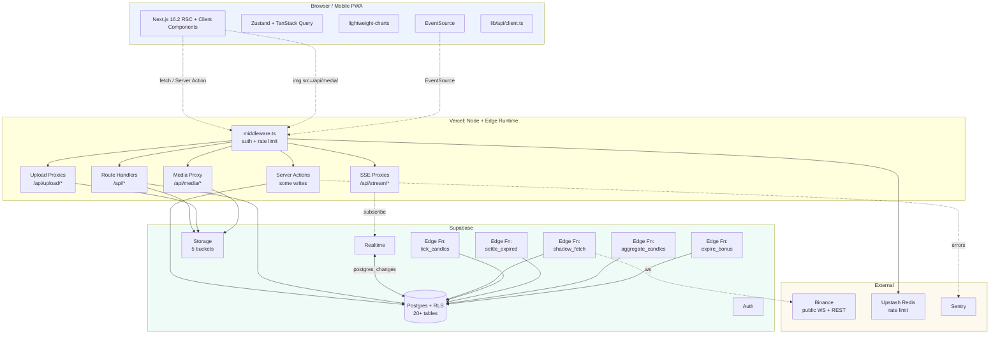

**Zero arrows from Client directly to Supabase or Binance.** All traffic through Vercel.

### 5.2 Tech stack (locked)

| Layer                                     | Choice                                                    | Version  |
| ----------------------------------------- | --------------------------------------------------------- | -------- |
| Framework                                 | Next.js (App Router, RSC, Server Actions, React Compiler) | **16.2** |
| React                                     | React (via Next)                                          | **19.2** |
| Language                                  | TypeScript `strict`                                       | 5.5+     |
| Node runtime                              | Node LTS                                                  | 22       |
| DB + Auth + Realtime + Storage + Edge Fns | Supabase                                                  | latest   |
| Client state                              | Zustand                                                   | 4        |
| Server state                              | TanStack Query                                            | 5        |
| Styling                                   | Tailwind CSS                                              | 3.4+     |
| UI primitives                             | shadcn/ui (Radix)                                         | latest   |
| Charts                                    | `lightweight-charts` (TradingView)                        | 4        |
| Forms                                     | react-hook-form + zod                                     | latest   |
| Animation                                 | framer-motion                                             | 11       |
| Icons                                     | lucide-react                                              | latest   |
| Rate limit                                | @upstash/ratelimit + Upstash Redis                        | latest   |
| Errors                                    | Sentry                                                    | latest   |
| Testing                                   | Vitest + Playwright + pgTAP                               | latest   |
| CI/CD                                     | GitHub Actions → Vercel                                   | —        |

### 5.3 Next.js 16.2 specifics used

- **React Compiler** enabled (`reactCompiler: true`) → auto-memoization → no manual `React.memo` / `useMemo` spam.
- **View Transitions API** for route changes between tokens (`/trade/BTC` → `/trade/ETH` slides smoothly).
- **`useEffectEvent`** for the tick interpolator — cleaner than refs.
- **Turbopack** for dev + build (stable).
- **Node.js middleware** (stable) for auth + rate limit.
- **Typed routes** — compiler validates every `<Link>`.
- **`cookies()` async** (has been since 15) — all server client constructors are `async`.

### 5.4 Trust boundaries

| Layer                                   | Trust         | Role                                                                             |
| --------------------------------------- | ------------- | -------------------------------------------------------------------------------- |
| Browser                                 | None          | Render + input. Zero DB access.                                                  |
| Next.js middleware                      | Partial       | Auth cookie validation, rate limit, role guard.                                  |
| Next.js Server Actions + Route Handlers | Trusted       | Run as user JWT (RLS-bound) or service role (admin-only).                        |
| Supabase DB                             | Trusted store | RLS is final line of defence. Money moves only via `security definer` functions. |
| Supabase Edge Fns                       | Trusted       | Service role, idempotent, cron-driven.                                           |

---

## 6. Database Tables

### Core (11)

| Table                                            | Purpose                                                               |
| ------------------------------------------------ | --------------------------------------------------------------------- |
| `profiles`                                       | One row per user. Role, username, avatar, is_frozen.                  |
| `user_balances`                                  | balance_cents + locked_in_trades + locked_bonus per user.             |
| `transactions`                                   | Immutable money ledger. Every debit/credit.                           |
| `tokens`                                         | Tradable crypto. Symbol, icon, base price, feed source, scale/offset. |
| `trade_periods`                                  | Duration options. Min/max amount, payout rate.                        |
| `user_trades`                                    | Every trade placed. Entry, direction, duration, status, outcome.      |
| `candles_1s`                                     | 1-second OHLC (partitioned monthly).                                  |
| `candles_1m`, `_5m`, `_15m`, `_1h`, `_4h`, `_1d` | Pre-aggregated higher TFs.                                            |
| `app_config`                                     | Singleton global settings.                                            |
| `admin_actions`                                  | Immutable audit log.                                                  |

### Invitations + Referrals (6)

| Table                  | Purpose                                                |
| ---------------------- | ------------------------------------------------------ |
| `invitation_codes`     | Unified code registry — user codes + admin-minted.     |
| `referrals`            | Edge between referee and referrer.                     |
| `referral_upline`      | Denormalized 5-level ancestor cache per user.          |
| `referral_rates`       | Per-user rate overrides (5 bps values).                |
| `referral_commissions` | Commission events. Pending → approved → (clawed_back). |
| `referral_flags`       | Auto-raised fraud advisories.                          |

### Money in/out (4)

| Table              | Purpose                                               |
| ------------------ | ----------------------------------------------------- |
| `wallet_addresses` | Admin-configured deposit addresses per token/network. |
| `deposits`         | User-submitted claims with screenshot paths.          |
| `withdrawals`      | Requests. Pending → approved → paid.                  |
| `bonus_tickets`    | Locked bonus balance with wager-progress tracking.    |

### Chart engine (2)

| Table                | Purpose                               |
| -------------------- | ------------------------------------- |
| `candle_replay_bank` | Historical OHLC for admin CSV replay. |
| `token_replay_state` | Cursor + speed per replaying token.   |

### CMS (1)

| Table         | Purpose                      |
| ------------- | ---------------------------- |
| `promo_slots` | Landing page content blocks. |

**Total: 24 tables + 6 candle TF tables = 30.**

---

## 7. Storage Buckets

| Bucket                | Visibility | Max size | Stores                                     |
| --------------------- | ---------- | -------- | ------------------------------------------ |
| `token-icons`         | public     | 512 KB   | Crypto logos (admin upload)                |
| `avatars`             | public     | 2 MB     | User profile pics (user upload own folder) |
| `promo-assets`        | public     | 5 MB     | Landing page hero + trust badges (admin)   |
| `deposit-proofs`      | private    | 5 MB     | User deposit screenshots                   |
| `withdrawal-receipts` | private    | 5 MB     | Admin tx screenshots on payout             |

**Access pattern:** all served via `/api/media/{bucket}/{path}` proxy. No direct Supabase URLs in client.

---

## 8. API Catalog

All browser-server communication. ~55 endpoints. REST-ish.

### Public (no auth)

```
POST  /api/auth/signup         Gated signup
POST  /api/auth/login          Email + password
POST  /api/auth/logout
POST  /api/auth/otp            Request magic link
GET   /api/invites/validate    ?code=REF_X
GET   /api/tokens              List enabled
GET   /api/periods             List enabled
GET   /api/candles             ?symbol=&tf=&limit=
GET   /api/promo/slots         Landing content
GET   /api/media/:bucket/:path Media proxy
```

### User (auth required)

```
GET    /api/me                        Profile + balance
PATCH  /api/me                        Update avatar/name
GET    /api/me/balance                Fresh balance breakdown
GET    /api/me/transactions           Paginated ledger
GET    /api/me/bonus-tickets          Open tickets + progress

GET    /api/trades?status=            Active / settled
POST   /api/trades                    Place a trade
POST   /api/trades/:id/cancel         Within 2s grace

GET    /api/wallets                   Deposit addresses
POST   /api/deposits                  Submit claim
GET    /api/deposits                  Own deposits
POST   /api/upload/deposit-proof      Multipart

POST   /api/withdrawals               Request withdrawal
GET    /api/withdrawals               Own withdrawals
DELETE /api/withdrawals/:id           Cancel (pending only)

GET    /api/referrals/stats           Tree counts + earnings
GET    /api/referrals/tree?level=     Downline at level
GET    /api/referrals/commissions     Own commission history

POST   /api/upload/avatar             Multipart

GET    /api/stream/user               SSE — trades/balance/bonus/deposits/withdrawals/commissions
GET    /api/stream/candles            SSE — ?symbol=&tf=
GET    /api/stream/ticker             SSE — all token prices
```

### Admin (auth + role=admin)

```
GET  /api/admin/trades?status=active
POST /api/admin/trades/:id/settle
POST /api/admin/trades/bulk-settle

GET  /api/admin/deposits?status=pending
POST /api/admin/deposits/:id/approve
POST /api/admin/deposits/:id/reject

GET  /api/admin/withdrawals?phase=1|2
POST /api/admin/withdrawals/:id/approve
POST /api/admin/withdrawals/:id/mark-paid
POST /api/admin/withdrawals/:id/reject

GET  /api/admin/commissions?status=pending
POST /api/admin/commissions/:id/approve
POST /api/admin/commissions/:id/reject
POST /api/admin/commissions/bulk-approve

GET  /api/admin/codes?source=&status=
POST /api/admin/codes/mint
POST /api/admin/codes/:code/revoke

GET  /api/admin/users?search=
GET  /api/admin/users/:id
POST /api/admin/users/:id/freeze
POST /api/admin/users/:id/adjust-balance
POST /api/admin/users/:id/set-rates

GET  /api/admin/flags?resolved=false
POST /api/admin/flags/:id/resolve

GET /POST /PATCH /DELETE  /api/admin/tokens[/:id]
GET /POST /PATCH /DELETE  /api/admin/periods[/:id]
GET /POST /PATCH /DELETE  /api/admin/wallets[/:id]
GET /POST /PATCH          /api/admin/promo[/:slug]

PATCH /api/admin/candles/controller/:tokenId
POST  /api/admin/candles/:tokenId/hard-set
POST  /api/admin/candles/:tokenId/replay/upload

GET  /api/admin/audit
GET  /api/admin/stream                SSE — all active trades, pending deposits, new flags

POST /api/admin/upload/token-icon     Multipart
POST /api/admin/upload/promo-asset    Multipart
```

---

## 9. Every Flow, Step by Step

Each flow: **plain English → sequence diagram → DB writes → failure modes.**

---

### 9.1 Signup with invitation code

**Plain English.** User visits `/signup?ref=REF_ALICE`. Types the code (prefilled from URL). System checks it live — green tick if valid. Form reveals. User enters username + email + password, submits. System creates account, mints starting balance as a locked signup bonus, binds referral chain if it was a user code (or leaves upline empty if admin code). User lands on `/trade`.

```mermaid
sequenceDiagram
    actor V as Visitor
    participant FE as /signup Page
    participant API as /api/invites/validate
    participant SU as /api/auth/signup
    participant AU as Supabase Auth Admin
    participant DB as Postgres
    participant T as Triggers + RPCs

    V->>FE: Open /signup?ref=REF_ALICE
    FE->>API: GET /api/invites/validate?code=REF_ALICE
    API->>DB: rpc validate_invite(code)
    DB-->>API: {valid:true, source:'user'}
    API-->>FE: ✓ Valid
    FE->>V: Reveal form

    V->>FE: Submit {code, email, password, username}
    FE->>SU: POST /api/auth/signup
    SU->>SU: Zod validate + rate limit by IP
    SU->>API: Re-validate code server-side
    SU->>AU: auth.admin.createUser({email, password})
    AU->>T: INSERT auth.users
    T->>DB: handle_new_user trigger<br/>→ INSERT profiles<br/>→ INSERT user_balances<br/>→ credit_bonus(signup) → INSERT bonus_tickets<br/>→ sync_user_invite_code → INSERT invitation_codes
    AU-->>SU: {user_id}
    SU->>DB: UPDATE profiles SET username
    alt Username taken
        DB-->>SU: error
        SU->>AU: auth.admin.deleteUser(user_id)  [rollback]
        SU-->>FE: 409 USERNAME_TAKEN
    end
    SU->>DB: rpc consume_invite(user_id, code, ip, ua)
    DB->>DB: SELECT FOR UPDATE code row<br/>Mark used/used-by<br/>IF source=user:<br/>&nbsp;&nbsp;bind_referral → INSERT referrals<br/>&nbsp;&nbsp;Walk chain → INSERT referral_upline (×5)<br/>&nbsp;&nbsp;check_referral_fraud (advisory)
    DB-->>SU: OK
    SU-->>FE: {ok, userId}
    FE->>V: Redirect /trade
```

**DB writes:** `auth.users`, `profiles`, `user_balances`, `bonus_tickets`, `invitation_codes` (mirror), `referrals`, `referral_upline`, maybe `referral_flags`.

**Failure modes.** Invalid code → form stays locked. Username taken → auth user rolled back. Two users on same single-use code → first wins via `FOR UPDATE`, second rolled back with `CODE_INACTIVE`.

---

### 9.2 Login

**Plain English.** User types email + password on `/login`. API sets SSR cookies. Redirected to `/trade`.

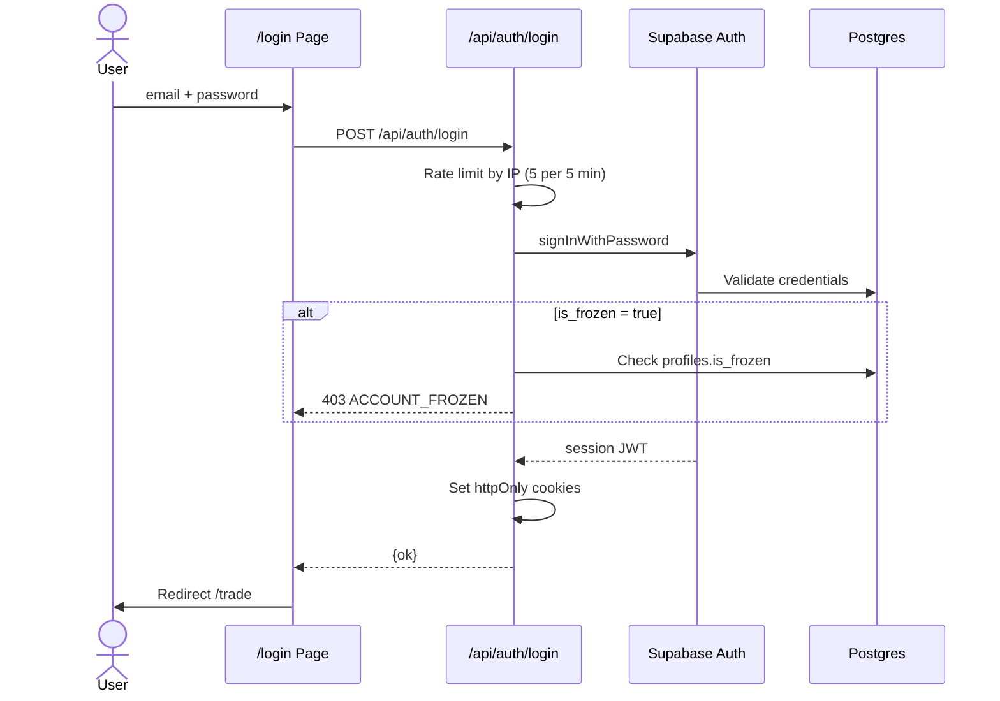

**DB writes:** none (session is in cookies + Supabase Auth internal tables).

**Failure modes.** Wrong password → `INVALID_CREDENTIALS`. Frozen account → `ACCOUNT_FROZEN`. Too many attempts → `RATE_LIMITED`.

---

### 9.3 Deposit — user submits, admin approves

**Plain English.** User picks token + network, sees QR + address. Sends crypto from their own wallet (off-platform). Uploads screenshot. Submits form. Admin sees it in the queue, reviews screenshot, clicks Approve. Balance credits. Referral commissions fire up the chain (first qualifying deposit only).

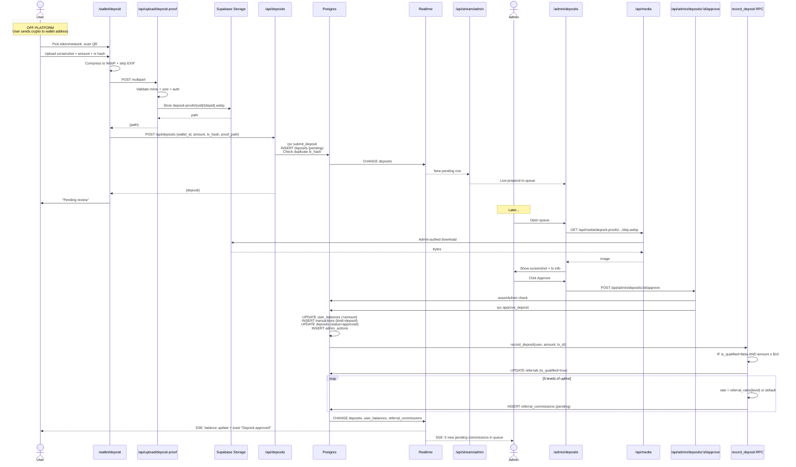

**DB writes:** `deposits`, `user_balances`, `transactions`, `admin_actions`, `referrals` (qualification), `referral_commissions` (×5 when qualifying).

**Storage writes:** `deposit-proofs/{user_id}/{deposit_id}.webp`.

**Failure modes.** Duplicate tx hash (same user) → rejected at submit. Missing proof → `PROOF_REQUIRED`. Wrong network (user-side error) → admin rejects with reason, funds lost off-platform (disclaimer shown prominently at deposit UI).

---

### 9.4 Place a trade

**Plain English.** User picks direction + duration + amount. Taps Place Trade. Server locks their balance, debits the stake, creates an active trade with entry-price snapshot. Countdown starts. Chart shows entry-line overlay. Any open bonus tickets get wager progress applied from this stake.

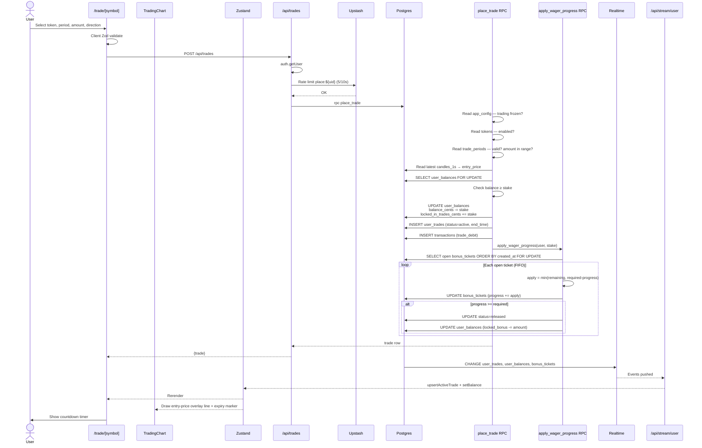

**DB writes:** `user_balances`, `user_trades`, `transactions`, `bonus_tickets`.

**Failure modes.** `INSUFFICIENT_FUNDS`, `AMOUNT_OUT_OF_RANGE`, `TOKEN_UNAVAILABLE`, `PERIOD_UNAVAILABLE`, `TRADING_FROZEN`, `RATE_LIMITED`.

---

### 9.5 Settle a trade (admin decision)

**Plain English.** Admin sees active trade in queue with countdown. Clicks Win / Lose / Void (or presses W / L / V). Balance updates. User gets a settlement toast within 500 ms.

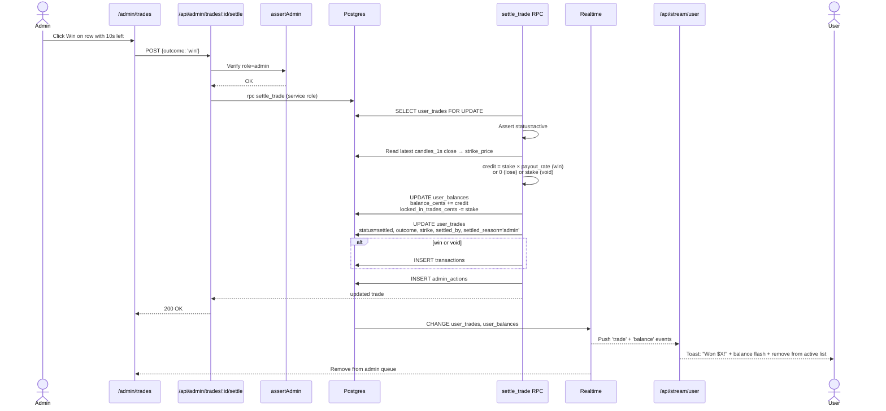

**DB writes:** `user_trades`, `user_balances`, `transactions` (if win/void), `admin_actions`.

**Failure modes.** `TRADE_NOT_ACTIVE` (already settled — race prevention). `TRADE_NOT_FOUND`. `FORBIDDEN` (non-admin).

---

### 9.6 Auto-expiry (no admin decision)

**Plain English.** Edge Function cron runs every 5 seconds. Finds trades where `end_time < now()` still marked active. Settles each with the configured default (usually lose). House wins the un-adjudicated book.

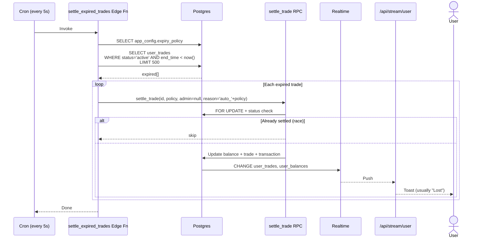

**DB writes:** per-trade: `user_trades`, `user_balances`, `transactions` (if win/void), `admin_actions` (null admin_id).

**Failure modes.** Edge fn crashes → next 5s cron picks up same batch. `FOR UPDATE` + status check = idempotent.

---

### 9.7 Referral commission (deposit → pending → approved → bonus ticket)

**Plain English.** Bob's first qualifying deposit triggers 5 pending commission rows up his chain. Admin reviews, approves each one. Approved commission doesn't credit balance directly — it mints a **bonus ticket** (locked, needs 3× wager before unlocking).

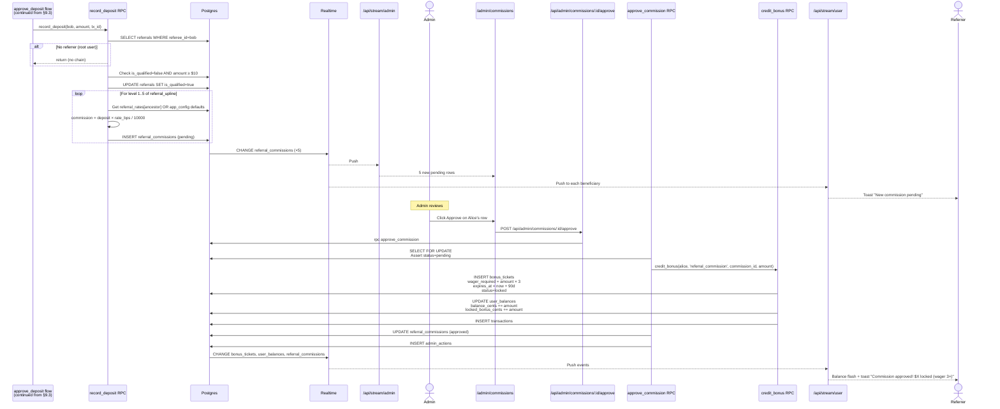

**DB writes:** `referrals` (qualification), `referral_commissions` (×5 on deposit). Per approval: `bonus_tickets`, `user_balances`, `transactions`, `referral_commissions` (status), `admin_actions`.

**Failure modes.** Upline < 5 levels deep → fewer rows. Bob is root user (admin code signup) → zero rows. Commission already reviewed → `ALREADY_REVIEWED`.

---

### 9.8 Bonus wagering unlock

**Plain English.** User has a locked $25 commission — must wager $75 total before it unlocks. Every trade they place contributes. Oldest ticket fills first. Once full, ticket status flips to "released" and `locked_bonus_cents` drops, making balance withdrawable.

```mermaid
sequenceDiagram
    actor U as User<br/>(ticket: $25 locked, needs $75)
    participant PT as place_trade (from §9.4)
    participant AW as apply_wager_progress RPC
    participant DB as Postgres
    participant SSE as /api/stream/user
    participant UI as /referrals + /wallet UI

    Note over U: State: tickets = [ $25/$75 progress 0 ]
    U->>PT: Place $30 trade
    PT->>AW: apply_wager_progress(user, 30)
    AW->>DB: SELECT locked tickets ORDER BY created_at FOR UPDATE
    AW->>AW: Ticket: apply = min(30, 75-0) = 30
    AW->>DB: UPDATE ticket (progress=30)

    Note over U: State: [ $25/$75 progress 30 ]
    U->>PT: Place $40 trade
    PT->>AW: apply_wager_progress(user, 40)
    AW->>AW: Ticket: apply = min(40, 75-30) = 40
    AW->>DB: UPDATE ticket (progress=70)

    Note over U: State: [ $25/$75 progress 70 ]
    U->>PT: Place $20 trade
    PT->>AW: apply_wager_progress(user, 20)
    AW->>AW: Ticket: apply = min(20, 75-70) = 5
    AW->>DB: UPDATE ticket (progress=75, status=released, released_at=now)
    AW->>DB: UPDATE user_balances (locked_bonus_cents -= 25)
    Note over AW: Remaining 15 overflow — if another ticket exists, fills it; else lost
    DB->>SSE: Push 'bonus_ticket' + 'balance' events
    SSE-->>UI: Toast "Bonus unlocked! $25 now withdrawable"
```

**DB writes:** `bonus_tickets` (progress / status), `user_balances` (locked_bonus).

**Edge case.** Ticket expires before wager completes → `expire_bonus_tickets` cron flips to `expired`, debits both `balance_cents` and `locked_bonus_cents`. Forfeited.

---

### 9.9 Withdrawal (two-phase admin flow)

**Plain English.** User requests withdrawal. Balance held immediately. Admin approves (Phase 1). Admin opens their Trust Wallet, sends crypto to user's address, copies tx hash, pastes into Mark as Paid (Phase 2). User sees "completed" with tx hash. Rejection refunds.

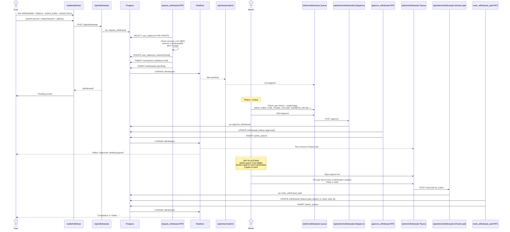

**DB writes:** `withdrawals`, `user_balances` (hold), `transactions` (hold), `admin_actions`. On rejection: refund debit + `refund_tx_id`. On cancel (user, pending only): refund.

**Failure modes.** `INSUFFICIENT_WITHDRAWABLE`, `BELOW_MIN_WITHDRAW`, `DEST_REQUIRED`. Marking paid without tx hash → `TX_HASH_REQUIRED`.

---

### 9.10 Chart tick (real price → displayed price)

**Plain English.** Binance WebSocket streams real market prices. Our edge fn pulls them, applies hidden scale + offset per token, writes current-second candle. Every second, `tick_candles` builds OHLC with synthetic micro-ticks. Client chart updates via SSE. Between server ticks, browser interpolates at 60 fps for a smooth price label.

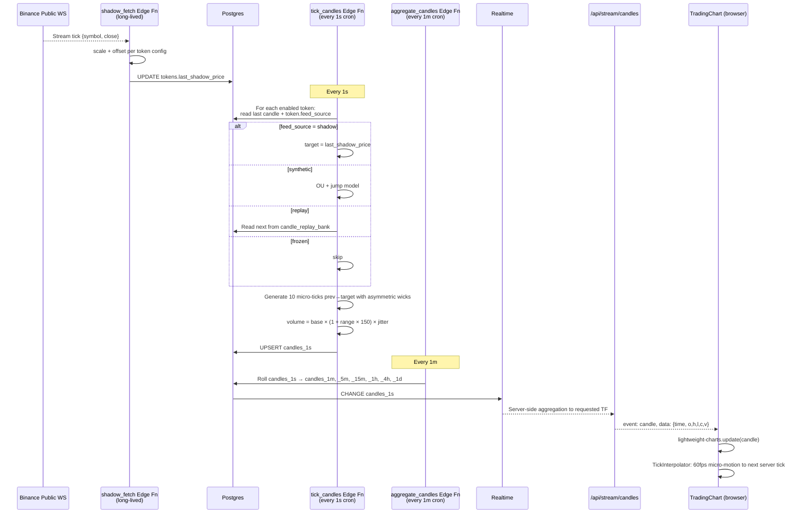

**DB writes per second:** 1 row per enabled token in `candles_1s`. Partitioned monthly, dropped after 14 days.

**Failure modes.** Binance WS drops → exponential backoff reconnect, tokens temporarily fall back to synthetic. Chart never freezes.

---

### 9.11 Realtime (SSE proxy) — the connection lifetime

**Plain English.** When a user opens the app, the browser opens an SSE connection to `/api/stream/user`. That connection lives for the session. Next.js subscribes to Supabase Realtime server-side and pushes filtered events down to the browser. All state (trades, balance, commissions, etc.) flows through this one pipe. Auto-reconnects on flap.

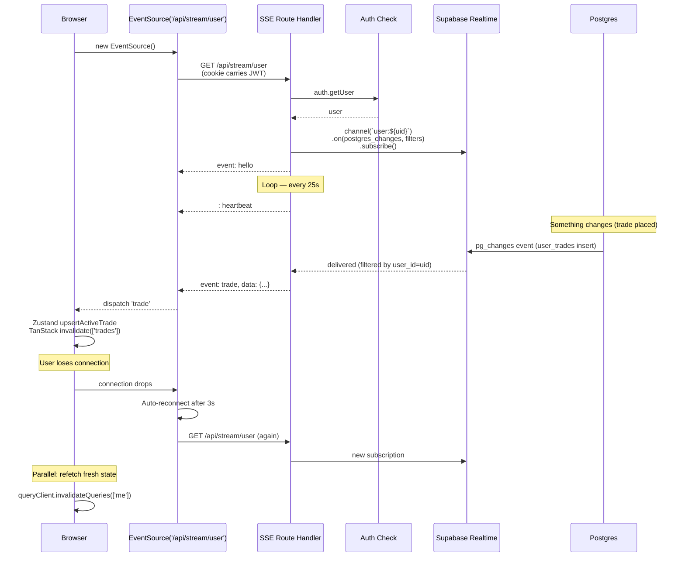

**Events streamed in one pipe:** `trade`, `balance`, `bonus_ticket`, `deposit`, `withdrawal`, `commission`. Each uses its named `event:` line so the client dispatches to the right handler.

**Connection limits.** 1 SSE connection per user per session. At 2000+ concurrent users, consider a dedicated WS server — noted in runbook, not needed for v1.

---

### 9.12 Image upload (deposit proof example)

**Plain English.** User picks file. Browser compresses to WebP + strips EXIF (GPS removal). Uploads via multipart POST to Next.js. Next.js validates and streams to Supabase Storage. Returns path. Browser includes path in deposit submission.

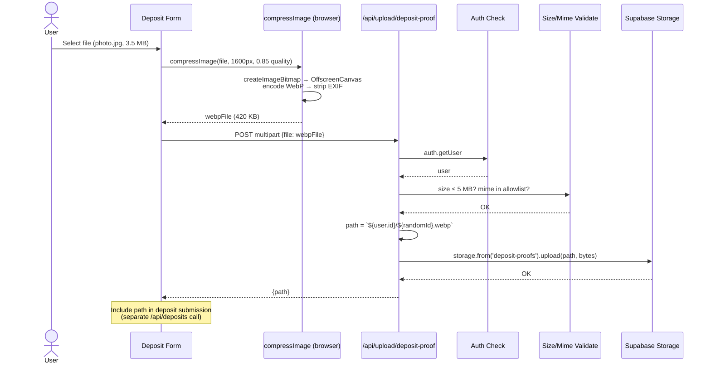

**Storage writes:** `deposit-proofs/{user_id}/{random}.webp`.

**Failure modes.** File > 5 MB → 413. Unsupported mime → 400. Unauthenticated → 401.

---

## 10. Security Model

### 10.1 Layered defences

| Layer            | Mechanism                                                                                              |
| ---------------- | ------------------------------------------------------------------------------------------------------ |
| Transport        | HTTPS only, TLS 1.3, HSTS                                                                              |
| Auth             | Supabase Auth, httpOnly + secure + sameSite=lax cookies                                                |
| Route guard      | `middleware.ts` redirects unauthed / non-admin                                                         |
| API guard        | `assertAdmin()` on every admin Route Handler — defence in depth                                        |
| DB isolation     | RLS on all 30 tables. Non-admin can only read own rows.                                                |
| Money writes     | Only via `security definer` functions with `FOR UPDATE` locks                                          |
| Service role     | Server-only import (`'server-only'`). Never in client bundle.                                          |
| Client bundle    | Zero Supabase references. Verified in CI.                                                              |
| Input validation | Zod on every endpoint + DB CHECK constraints                                                           |
| Rate limit       | Global 300/min per IP + per-user-action specific limits                                                |
| Audit            | `admin_actions` immutable ledger + Sentry breadcrumbs                                                  |
| CSRF             | Same-origin cookies; SameSite=lax. Server Actions have built-in protection.                            |
| XSS              | React escapes by default. SVG upload disabled for user-writable buckets.                               |
| Secrets          | Vercel encrypted env. Rotated on admin offboarding.                                                    |
| Storage          | Bucket-level mime + size allowlist. Private buckets via 10-min signed URLs through `/api/media` proxy. |

### 10.2 Error taxonomy (never leak Postgres errors)

```
UNAUTHENTICATED | FORBIDDEN | RATE_LIMITED | INVALID_INPUT | INTERNAL_ERROR
ACCOUNT_FROZEN | INVALID_CREDENTIALS

Trade: INSUFFICIENT_FUNDS | AMOUNT_OUT_OF_RANGE | TOKEN_UNAVAILABLE | PERIOD_UNAVAILABLE
       TRADING_FROZEN | TRADE_NOT_FOUND | TRADE_NOT_ACTIVE

Signup: CODE_NOT_FOUND | CODE_INACTIVE | CODE_EXPIRED | CODE_EXHAUSTED | CODE_CONSUME_FAILED
        AUTH_CREATE_FAILED | USERNAME_TAKEN

Deposit: WALLET_DISABLED | AMOUNT_BELOW_MIN | PROOF_REQUIRED | DUPLICATE_TX_HASH
         DEPOSIT_NOT_FOUND | ALREADY_REVIEWED

Withdraw: BELOW_MIN_WITHDRAW | DEST_REQUIRED | INSUFFICIENT_WITHDRAWABLE | FEE_EXCEEDS_AMOUNT
          NOT_PENDING | NOT_APPROVED | NOT_REFUNDABLE | NOT_CANCELLABLE | TX_HASH_REQUIRED

Referral: COMMISSION_NOT_FOUND | REF_CODE_IN_USE | SELF_REFERRAL_BLOCKED

Upload: FILE_REQUIRED | TOO_LARGE | BAD_MIME | UPLOAD_FAILED
```

All wrapped as `{ error: { code, message } }` with appropriate HTTP status.

### 10.3 Exploit matrix

| Exploit                                    | Mitigation                                                 |
| ------------------------------------------ | ---------------------------------------------------------- |
| Screenshot the chart, claim rigged outcome | Scale + offset hide real price — not comparable to Binance |
| Fake account farm for commissions          | Advisory flags + bonus wager requirement + admin approval  |
| Forged deposit screenshot                  | Tx hash dedup + admin review + reject reason               |
| Self-referral (fake downline)              | Same-IP flag + velocity flag, admin visibility             |
| Rapid deposit → withdrawal                 | `RAPID` flag surfaced on withdrawal review                 |
| Username change to hijack referral link    | Trigger blocks rename when code is in use                  |
| Direct Supabase call from browser          | Impossible — no client-side Supabase lib                   |
| Replay old Server Action call              | Rate limit + Zod input validation + idempotency at DB      |
| Session theft                              | httpOnly + secure cookies, short JWT TTL, admin can revoke |

---

## 11. Progress Tracker

Phase-by-phase. Every task a checkbox. Engineer picks up, completes, ticks.

**Estimated total: 41 engineer-days** (1–2 devs full-time → ~6 calendar weeks).

---

### Sprint 0 — Foundations (3 days)

**Goal.** Repo skeleton, Supabase project, core schema, auth, zero Supabase in client bundle.

- [x] Initialize Next.js 16.2 with App Router, TypeScript strict, Turbopack
- [x] Enable React Compiler (`reactCompiler: true`)
- [ ] Install Tailwind, shadcn/ui, lucide-react, framer-motion, zustand, zod, react-hook-form, @tanstack/react-query
- [ ] Create Supabase project (dev + prod)
- [ ] Install Supabase CLI + link project
- [ ] Configure local dev (`supabase start`)
- [x] Migration `0001_init.sql` — profiles, user_balances, transactions, tokens, trade_periods, user_trades, candles_1s, admin_actions, app_config
- [x] Migration `0004_rls.sql` — all policies + `is_admin()` function
- [x] `handle_new_user` trigger — auto profile + balance
- [x] Create `lib/supabase/server.ts` and `lib/supabase/admin.ts` with `'server-only'`
- [x] Confirm `lib/supabase/client.ts` does **not** exist
- [x] Middleware: auth redirect + admin guard + global rate limit
- [x] `lib/auth/assertAdmin.ts` helper
- [x] Tailwind config with Trust-Wallet dark tokens (bg, border, up, down, brand)
- [x] `lib/api/client.ts` + error envelope helpers
- [x] Playwright smoke test: unauthenticated /trade redirects to /login
- [x] CI: `grep "supabase" .next/static/chunks | wc -l` must equal 0
- [ ] Bootstrap one admin user manually via SQL

**Exit.** Login works. Protected routes redirect. No Supabase in client bundle.

**Sprint 0 log — 2026-04-19**

### Phase 1: Foundation slice
- [x] Enable React Compiler and install repo-local foundation dependencies — `package.json` (modified), `pnpm-lock.yaml` (modified), `next.config.ts` (modified)
- [x] Create server-only backend helpers and API client primitives — `lib/env/server.ts` (created), `lib/supabase/server.ts` (created), `lib/supabase/admin.ts` (created), `lib/api/client.ts` (created), `lib/config/site.ts` (created), `lib/utils/format.ts` (created)
- [x] Replace placeholder app metadata and Trust-Wallet-style design tokens — `app/layout.tsx` (modified), `app/globals.css` (modified)

### Phase 2: Product shell
- [x] Build the first trading shell with shared constants and clean types — `types/platform.ts` (created), `lib/constants/platform.ts` (created), `components/home/section-heading.tsx` (created), `components/home/trustpro-shell.tsx` (created), `app/page.tsx` (modified)
- [x] Use Zustand for shared state and TanStack Table for the first admin queue surface — `stores/trading-shell-store.ts` (created), `components/home/trading-workbench.tsx` (created), `components/home/settlement-queue-table.tsx` (created)

### Phase 3: Verify
- [x] Verify lint, production build, and client-bundle Supabase isolation — `pnpm lint`, `pnpm build`, `grep -R "supabase" .next/static/chunks | wc -l` = `0`
- [ ] External infra still blocked — Supabase project creation, CLI linking, `supabase start`, SQL migrations, auth middleware, and admin bootstrap remain for the next phase

### Phase 4: Auth route scaffold
- [x] Add preview login flow and protected route shells — `app/actions/auth.ts` (created), `components/auth/login-form.tsx` (created), `app/login/page.tsx` (created), `app/trade/page.tsx` (created), `app/admin/page.tsx` (created), `schemas/auth.ts` (created)
- [x] Add proxy-based auth redirect and admin guard scaffold — `proxy.ts` (created), `lib/auth/constants.ts` (created), `lib/auth/session.ts` (created), `lib/auth/assertAdmin.ts` (created)

### Phase 5: Proxy rate limit + smoke test
- [x] Add proxy-safe global rate limit scaffold and response headers — `lib/rate-limit/proxy.ts` (created), `proxy.ts` (modified)
- [x] Add Playwright config and unauthenticated redirect smoke test — `playwright.config.ts` (created), `tests/e2e/auth-redirect.spec.ts` (created), `package.json` (modified), `.gitignore` (modified)
- [x] Execute the smoke test with installed Chromium — `pnpm exec playwright install chromium`, `pnpm test:e2e`

### Phase 6: Supabase schema + setup docs
- [x] Create Sprint 0 core Supabase schema migration — `supabase/migrations/0001_init.sql` (created)
- [x] Create RLS migration with `is_admin()` policies — `supabase/migrations/0004_rls.sql` (created)
- [x] Create separate Supabase setup guide and runnable SQL helpers — `SUPABASE_SETUP.md` (created), `supabase/sql/110_promote_admin.sql` (created), `supabase/sql/120_verify_setup.sql` (created)
- [ ] Project creation, CLI linking, and migration execution remain manual until the local Supabase CLI issue is fixed

**Files touched:**
- `.gitignore` — modified
- `SUPABASE_SETUP.md` — created
- `app/actions/auth.ts` — created
- `app/admin/page.tsx` — created
- `app/globals.css` — modified
- `app/layout.tsx` — modified
- `app/login/page.tsx` — created
- `app/page.tsx` — modified
- `app/trade/page.tsx` — created
- `components/auth/login-form.tsx` — created
- `components/home/section-heading.tsx` — created
- `components/home/settlement-queue-table.tsx` — created
- `components/home/trading-workbench.tsx` — created
- `components/home/trustpro-shell.tsx` — created
- `lib/auth/assertAdmin.ts` — created
- `lib/auth/constants.ts` — created
- `lib/auth/session.ts` — created
- `lib/api/client.ts` — created
- `lib/config/site.ts` — created
- `lib/constants/platform.ts` — created
- `lib/env/server.ts` — created
- `lib/rate-limit/proxy.ts` — created
- `lib/supabase/admin.ts` — created
- `lib/supabase/server.ts` — created
- `lib/utils/format.ts` — created
- `next.config.ts` — modified
- `package.json` — modified
- `pnpm-lock.yaml` — modified
- `playwright.config.ts` — created
- `proxy.ts` — created
- `schemas/auth.ts` — created
- `stores/trading-shell-store.ts` — created
- `supabase/migrations/0001_init.sql` — created
- `supabase/migrations/0004_rls.sql` — created
- `supabase/sql/110_promote_admin.sql` — created
- `supabase/sql/120_verify_setup.sql` — created
- `tests/e2e/auth-redirect.spec.ts` — created
- `types/platform.ts` — created

---

### Sprint 0.5 — Invitation Gate (2 days)

**Goal.** Signup impossible without a code.

- [x] Migration `0006_invitation_codes.sql` — invitation_codes + triggers + expiry/use status
- [x] DB functions: `validate_invite`, `consume_invite`, `mint_invite_codes`, `revoke_invite`
- [x] `/signup` page with gated form (code validates live, form reveals)
- [x] `/api/invites/validate` GET Route Handler
- [x] `/api/auth/signup` POST Route Handler (create user + rollback on failure + consume_invite)
- [x] `/admin/invites` page — two tabs: All Codes + Mint
- [x] `/api/admin/codes/mint` POST (1–1000 at once)
- [x] `/api/admin/codes/:code/revoke` POST
- [x] CSV export for minted batches
- [x] Tests: single-use semantics, race condition (concurrent signups), revocation, expiry auto-flip
- [x] Playwright: signup without code → rejected; with valid code → account created

**Exit.** No code, no account. Admin can mint and revoke. All exit criteria from §24.12 met.

**Sprint 0.5 log — 2026-04-19**

### Phase 1: Invitation DB layer
- [x] Create invitation registry migration with sync trigger and expiry/use state — `supabase/migrations/0006_invitation_codes.sql` (created)
- [x] Add invitation RPC layer for validation, consume, mint, and revoke — `supabase/migrations/0006_invitation_codes.sql` (modified in-place)

### Phase 2: Invitation UX + API
- [x] Add invite validation service with live Supabase path and preview fallback — `lib/env/server.ts` (modified), `lib/invites/preview-data.ts` (created), `lib/invites/service.ts` (created), `schemas/invites.ts` (created), `types/invites.ts` (created)
- [x] Build `/api/invites/validate`, `/api/auth/signup`, and gated `/signup` shell — `app/api/invites/validate/route.ts` (created), `app/api/auth/signup/route.ts` (created), `components/auth/signup-form.tsx` (created), `app/signup/page.tsx` (created)

### Phase 3: Verify
- [x] Verify lint and production build after the invitation slice — `pnpm lint`, `pnpm build`
- [x] Queue invitation lifecycle tests and signup Playwright coverage for the next slice

### Phase 4: Admin invite control panel
- [x] Add protected admin invite backend helpers with preview/live paths — `lib/auth/assert-admin-api.ts` (created), `lib/invites/admin-service.ts` (created), `lib/invites/preview-data.ts` (modified), `schemas/invites.ts` (modified), `types/invites.ts` (modified)
- [x] Add admin mint and revoke Route Handlers — `app/api/admin/codes/mint/route.ts` (created), `app/api/admin/codes/[code]/revoke/route.ts` (created)
- [x] Build `/admin/invites` with All Codes, Mint, revoke actions, and batch CSV export — `app/admin/invites/page.tsx` (created), `components/admin/invite-control-panel.tsx` (created), `app/admin/page.tsx` (modified)

### Phase 5: Verify
- [x] Verify lint and production build after the admin invite slice — `pnpm lint`, `pnpm build`
- [x] Keep invitation lifecycle tests and signup Playwright coverage queued for the next slice

### Phase 6: Preview signup completion + lifecycle tests
- [x] Extend preview signup to create temporary users, consume invites, and surface success on login — `lib/invites/preview-data.ts` (modified), `lib/invites/service.ts` (modified), `app/login/page.tsx` (modified)
- [x] Add Playwright coverage for invitation lifecycle and signup UX — `tests/e2e/invite-signup.spec.ts` (created)
- [x] Apply the Next scroll-behavior marker and stable lint ignores uncovered during verification — `app/layout.tsx` (modified), `eslint.config.mjs` (modified)

### Phase 7: Verify
- [x] Verify lint, production build, and Playwright after the invitation test slice — `pnpm lint`, `pnpm build`, `pnpm test:e2e`
- [x] Sprint 0.5 invitation gate is complete

**Files touched:**
- `app/api/auth/signup/route.ts` — created
- `app/api/admin/codes/[code]/revoke/route.ts` — created
- `app/api/admin/codes/mint/route.ts` — created
- `app/api/invites/validate/route.ts` — created
- `app/admin/invites/page.tsx` — created
- `app/layout.tsx` — modified
- `app/login/page.tsx` — modified
- `app/signup/page.tsx` — created
- `app/admin/page.tsx` — modified
- `components/admin/invite-control-panel.tsx` — created
- `components/auth/signup-form.tsx` — created
- `eslint.config.mjs` — modified
- `lib/auth/assert-admin-api.ts` — created
- `lib/env/server.ts` — modified
- `lib/invites/admin-service.ts` — created
- `lib/invites/preview-data.ts` — modified
- `lib/invites/service.ts` — modified
- `schemas/invites.ts` — modified
- `supabase/migrations/0006_invitation_codes.sql` — created
- `tests/e2e/invite-signup.spec.ts` — created
- `types/invites.ts` — modified

---

### Sprint 1 — Markets & Realistic Chart (6 days)

**Goal.** Professional live chart + admin price control.

- [x] Migration `0010_chart_engine.sql` — tokens extensions, candle_replay_bank, token_replay_state, candles_1m through \_1d tables
- [x] Migration `0011_storage_buckets.sql` — all 5 buckets with mime + size limits + RLS
- [x] Admin token CRUD: `/admin/tokens` page + `/api/admin/tokens` endpoints
- [x] Admin period CRUD: `/admin/periods` page + endpoints
- [x] Admin wallet CRUD: `/admin/wallets` + endpoints (last-8-char confirm)
- [x] Admin icon upload: `/api/admin/upload/token-icon`
- [x] Media proxy: `/api/media/[bucket]/[...path]` Route Handler
- [x] Public reads: `/api/tokens`, `/api/periods`, `/api/candles`
- [x] Edge Fn: `shadow_fetch` — Binance WS subscriber, scale+offset, updates `tokens.last_shadow_price`
- [x] Edge Fn: `tick_candles` — 1-second cron, generates OHLC with GBM or shadow or replay
- [x] Edge Fn: `aggregate_candles` — 1-minute cron, rolls up higher TFs
- [x] `/api/stream/candles` SSE Route Handler with server-side TF aggregation
- [x] `/api/stream/ticker` SSE Route Handler — all token prices
- [x] `TradingChart.tsx` with lightweight-charts v5 — candles + volume + crosshair + TF tabs
- [x] `TickInterpolator` hook — 60 fps sub-tick animation (rAF + ease-out cubic)
- [x] `useCandleStream` hook — SSE → chart update + auto-reconnect
- [x] `OrderBookIllusion.tsx` — synthetic depth ladder with 2s jitter
- [x] `TickerStrip.tsx` — infinite marquee of all tokens
- [x] `/admin/candles` controller — freeze, nudge, hard-set, feed-source toggle
- [x] Replay CSV upload: `/api/admin/candles/:id/replay/upload`
- [x] "Pull from Binance" button — fetches 500 1m candles via REST, seeds `candle_replay_bank`
- [x] Migration `0012_wallet_addresses.sql` — wallet_addresses table + RLS
- [x] Public wallets endpoint: `/api/wallets`
- [ ] Tests: shadow scale hidden in API; multi-TF aggregation integrity; micro-tick range bounds; replay cursor advance

**Exit.** Chart at 1s–1d TFs, follows real BTC via shadow, admin can freeze/replay, price label 60 fps smooth.

**Sprint 1 log — 2026-04-19**

### Phase 1: Chart/storage schema slice
- [x] Extend token market controls, add replay tables, and add higher timeframe candle tables with RLS — `supabase/migrations/0010_chart_engine.sql` (created)
- [x] Add all five storage buckets with size/mime rules and object policies — `supabase/migrations/0011_storage_buckets.sql` (created)

### Phase 2: Verify
- [x] Verify app lint and production build still pass after the schema slice — `pnpm lint`, `pnpm build`
- [ ] Applying migrations locally is still blocked until the Supabase CLI/local project path is fixed

### Phase 3: Public market reads
- [x] Add market schemas, preview/live service, and preview candle generation — `types/market.ts` (created), `schemas/market.ts` (created), `lib/markets/preview-data.ts` (created), `lib/markets/service.ts` (created), `lib/utils/format.ts` (modified)
- [x] Add public token, period, and candle Route Handlers — `app/api/tokens/route.ts` (created), `app/api/periods/route.ts` (created), `app/api/candles/route.ts` (created)
- [x] Wire the home shell to server-fetched market tokens instead of hardcoded snapshots — `app/page.tsx` (modified), `components/home/trustpro-shell.tsx` (modified), `components/home/trading-workbench.tsx` (modified), `lib/constants/platform.ts` (modified), `types/platform.ts` (modified)

### Phase 4: Verify
- [x] Verify lint and production build after the public market read slice — `pnpm lint`, `pnpm build`
- [ ] Admin token CRUD, media proxy, and live chart streaming still remain

### Phase 5: Admin token control
- [x] Add admin token schemas and preview/live CRUD service — `types/market.ts` (modified), `schemas/market.ts` (modified), `lib/markets/preview-data.ts` (modified), `lib/markets/admin-service.ts` (created)
- [x] Add admin token CRUD Route Handlers — `app/api/admin/tokens/route.ts` (created), `app/api/admin/tokens/[id]/route.ts` (created)
- [x] Build `/admin/tokens` control panel and link it from the admin hub — `app/admin/tokens/page.tsx` (created), `components/admin/token-control-panel.tsx` (created), `app/admin/page.tsx` (modified)

### Phase 6: Verify
- [x] Verify lint and production build after the admin token slice — `pnpm lint`, `pnpm build`
- [ ] Admin periods, wallets, media proxy, and live chart streaming still remain

### Phase 7: Admin period control
- [x] Add admin trade-period schemas and preview/live CRUD service — `types/market.ts` (modified), `schemas/market.ts` (modified), `lib/markets/preview-data.ts` (modified), `lib/markets/admin-service.ts` (modified)
- [x] Add admin trade-period CRUD Route Handlers — `app/api/admin/periods/route.ts` (created), `app/api/admin/periods/[id]/route.ts` (created)
- [x] Build `/admin/periods` control panel and link it from the admin hub — `app/admin/periods/page.tsx` (created), `components/admin/period-control-panel.tsx` (created), `app/admin/page.tsx` (modified)

### Phase 8: Verify
- [x] Verify lint and production build after the admin period slice — `pnpm lint`, `pnpm build`
- [ ] Wallet CRUD, media slice, and live chart streaming still remained at this point

### Phase 9: Media proxy and token icon upload
- [x] Add shared media bucket schemas, typed upload results, path builder, and preview/live storage service — `types/media.ts` (created), `schemas/media.ts` (created), `lib/media/path.ts` (created), `lib/media/preview-data.ts` (created), `lib/media/service.ts` (created)
- [x] Add token icon upload and media proxy Route Handlers — `app/api/admin/upload/token-icon/route.ts` (created), `app/api/media/[bucket]/[...path]/route.ts` (created)
- [x] Wire token admin to upload through the storage route and preview the saved icon path — `components/admin/token-control-panel.tsx` (modified), `app/admin/tokens/page.tsx` (modified)

### Phase 10: Verify
- [x] Verify lint and production build after the media slice — `pnpm lint`, `pnpm build`
- [ ] Wallet CRUD and live chart streaming still remain

### Phase 11: Admin wallet CRUD + wallet addresses migration
- [x] Add wallet address types, schemas, preview data, and live service — `types/wallet.ts` (created), `schemas/wallet.ts` (created), `lib/wallets/preview-data.ts` (created), `lib/wallets/admin-service.ts` (created), `lib/wallets/service.ts` (created)
- [x] Add admin wallet CRUD Route Handlers with last-8-char confirm UI — `app/api/admin/wallets/route.ts` (created), `app/api/admin/wallets/[id]/route.ts` (created)
- [x] Add public wallets endpoint — `app/api/wallets/route.ts` (created)
- [x] Build `/admin/wallets` control panel and wallet migration — `app/admin/wallets/page.tsx` (created), `components/admin/wallet-control-panel.tsx` (created), `supabase/migrations/0012_wallet_addresses.sql` (created), `app/admin/page.tsx` (modified)

### Phase 12: Edge functions + SSE streams
- [x] Write shadow_fetch Supabase edge function (Binance WS → scale+offset → tokens table) — `supabase/functions/shadow_fetch/index.ts` (created)
- [x] Write tick_candles edge function (1s cron, shadow/synthetic/replay/frozen modes) — `supabase/functions/tick_candles/index.ts` (created)
- [x] Write aggregate_candles edge function (1m cron, roll up to all TFs) — `supabase/functions/aggregate_candles/index.ts` (created)
- [x] Add SSE candle stream (preview + live Realtime path) — `app/api/stream/candles/route.ts` (created)
- [x] Add SSE ticker stream (all tokens, 2s updates) — `app/api/stream/ticker/route.ts` (created)
- [x] Exclude supabase/functions from TypeScript compilation — `tsconfig.json` (modified)

### Phase 13: Chart UI — TradingChart, TickInterpolator, hooks
- [x] Add `lightweight-charts` v5 dependency — `package.json` (modified), `pnpm-lock.yaml` (modified)
- [x] Build `useTickInterpolator` hook (60fps rAF loop, no render-time ref writes) — `hooks/useTickInterpolator.ts` (created)
- [x] Build `useCandleStream` hook (SSE + exponential-backoff reconnect) — `hooks/useCandleStream.ts` (created)
- [x] Build `TradingChart.tsx` (lightweight-charts v5 API, candlestick + volume, 8 TF tabs) — `components/chart/TradingChart.tsx` (created)

### Phase 14: Order book illusion + ticker strip
- [x] Build `OrderBookIllusion.tsx` (seeded synthetic depth, 2s jitter, no Math.random during render) — `components/chart/OrderBookIllusion.tsx` (created)
- [x] Build `TickerStrip.tsx` (infinite CSS marquee, SSE price updates, connectRef pattern) — `components/chart/TickerStrip.tsx` (created)

### Phase 15: Admin candle controller
- [x] Add candle controller PATCH Route Handler (feed source, drift bias) — `app/api/admin/candles/controller/[tokenId]/route.ts` (created)
- [x] Add hard-set price POST Route Handler — `app/api/admin/candles/[tokenId]/hard-set/route.ts` (created)
- [x] Add replay CSV upload POST Route Handler — `app/api/admin/candles/[tokenId]/replay/upload/route.ts` (created)
- [x] Add Pull-from-Binance POST Route Handler (500 × 1m klines) — `app/api/admin/candles/[tokenId]/replay/pull-binance/route.ts` (created)
- [x] Build `CandleControllerPanel` component and `/admin/candles` page — `components/admin/candle-controller-panel.tsx` (created), `app/admin/candles/page.tsx` (created), `app/admin/page.tsx` (modified)
- [x] Add candle controller types — `types/candle-controller.ts` (created)

### Phase 16: Verify
- [x] Verify lint (0 errors) and production build pass — `pnpm lint`, `pnpm build`

**Files touched (Sprint 1 phases 11–16):**
- `IMPLEMENTATION.md` — modified
- `app/admin/candles/page.tsx` — created
- `app/admin/page.tsx` — modified
- `app/admin/wallets/page.tsx` — created
- `app/api/admin/candles/[tokenId]/hard-set/route.ts` — created
- `app/api/admin/candles/[tokenId]/replay/pull-binance/route.ts` — created
- `app/api/admin/candles/[tokenId]/replay/upload/route.ts` — created
- `app/api/admin/candles/controller/[tokenId]/route.ts` — created
- `app/api/admin/wallets/[id]/route.ts` — created
- `app/api/admin/wallets/route.ts` — created
- `app/api/stream/candles/route.ts` — created
- `app/api/stream/ticker/route.ts` — created
- `app/api/wallets/route.ts` — created
- `components/admin/candle-controller-panel.tsx` — created
- `components/admin/wallet-control-panel.tsx` — created
- `components/chart/OrderBookIllusion.tsx` — created
- `components/chart/TickerStrip.tsx` — created
- `components/chart/TradingChart.tsx` — created
- `hooks/useCandleStream.ts` — created
- `hooks/useTickInterpolator.ts` — created
- `lib/wallets/admin-service.ts` — created
- `lib/wallets/preview-data.ts` — created
- `lib/wallets/service.ts` — created
- `package.json` — modified
- `pnpm-lock.yaml` — modified
- `schemas/wallet.ts` — created
- `supabase/functions/aggregate_candles/index.ts` — created
- `supabase/functions/shadow_fetch/index.ts` — created
- `supabase/functions/tick_candles/index.ts` — created
- `supabase/migrations/0012_wallet_addresses.sql` — created
- `tsconfig.json` — modified
- `types/candle-controller.ts` — created
- `types/wallet.ts` — created

**Files touched:**
- `IMPLEMENTATION.md` — modified
- `app/admin/page.tsx` — modified
- `app/admin/periods/page.tsx` — created
- `app/admin/tokens/page.tsx` — created, modified
- `app/api/admin/periods/[id]/route.ts` — created
- `app/api/admin/periods/route.ts` — created
- `app/api/admin/tokens/[id]/route.ts` — created
- `app/api/admin/tokens/route.ts` — created
- `app/api/admin/upload/token-icon/route.ts` — created
- `app/api/candles/route.ts` — created
- `app/api/media/[bucket]/[...path]/route.ts` — created
- `app/api/periods/route.ts` — created
- `app/api/tokens/route.ts` — created
- `app/page.tsx` — modified
- `components/admin/period-control-panel.tsx` — created
- `components/admin/token-control-panel.tsx` — created, modified
- `components/home/trading-workbench.tsx` — modified
- `components/home/trustpro-shell.tsx` — modified
- `lib/constants/platform.ts` — modified
- `lib/media/path.ts` — created
- `lib/media/preview-data.ts` — created
- `lib/media/service.ts` — created
- `lib/markets/admin-service.ts` — modified
- `lib/markets/preview-data.ts` — modified
- `lib/markets/service.ts` — created
- `lib/utils/format.ts` — modified
- `schemas/media.ts` — created
- `schemas/market.ts` — modified
- `supabase/migrations/0010_chart_engine.sql` — created
- `supabase/migrations/0011_storage_buckets.sql` — created
- `types/media.ts` — created
- `types/market.ts` — modified
- `types/platform.ts` — modified

---

### Sprint 2 — Order Ticket & Active Positions (5 days)

**Goal.** End-to-end trade flow with countdowns.

- [x] Migration `0002_place_trade.sql` — `place_trade` + `apply_wager_progress` security definer functions
- [x] `/api/trades` POST (place) + GET (list, filterable by status)
- [x] `/api/trades/:id` GET
- [x] `/api/trades/:id/cancel` POST (2s grace)
- [x] `/api/me` GET + PATCH
- [x] `/api/me/balance` GET
- [x] `/api/stream/user` SSE Route Handler — snapshot + trade/balance/settlement events in one pipe
- [x] `useUserStream()` hook wiring SSE → Zustand + TanStack invalidations, exponential-backoff reconnect
- [x] `OrderTicket.tsx` composite — LongShortToggle, PeriodSelector, AmountInput, PayoutPreview
- [x] `ActivePositionsList.tsx` + `PositionRow.tsx`
- [x] `Countdown.tsx` — drift-free, absolute end time, pulse red at <10s
- [x] `SettlementToast.tsx` — win/lose/void toast with auto-dismiss
- [x] `BalanceHeader.tsx` — flash green/red on balance change
- [x] `TradeShell.tsx` — client shell wiring chart + order ticket + positions + toasts
- [x] `/trade/[symbol]` dynamic page — server-fetched token, periods, candles, balance, active trades
- [x] `/trade` redirects to first enabled token
- [x] `QueryProvider.tsx` — TanStack Query root provider added to layout
- [x] Upstash rate limit: `place:${uid}` @ 5/10s (graceful no-op when Redis not configured)
- [x] `lib/auth/assert-user-api.ts` — user auth guard for Route Handlers (preview + live)
- [ ] Chart overlay: entry price line + expiry marker per active trade (deferred to Sprint 3 chart work)
- [ ] Tests: happy path win + lose; insufficient funds; rate limit; trade page mobile

**Exit.** User places a trade from UI. Admin (via SQL) marks it settled. User sees toast within 500 ms.

**Sprint 2 log — 2026-04-19**

### Phase 1: DB migration
- [x] Write `place_trade` and `apply_wager_progress` security-definer SQL functions — `supabase/migrations/0002_place_trade.sql` (created)

### Phase 2: Types + schemas
- [x] Trade + profile types and Zod schemas — `types/trade.ts` (created), `schemas/trade.ts` (created)

### Phase 3: Services
- [x] Trade preview data (in-memory store, mock active/settled trades) — `lib/trades/preview-data.ts` (created)
- [x] Trade + profile live service (preview/live dual path) — `lib/trades/service.ts` (created)

### Phase 4: API routes
- [x] Trade list + place — `app/api/trades/route.ts` (created)
- [x] Trade get — `app/api/trades/[id]/route.ts` (created)
- [x] Trade cancel (2s grace) — `app/api/trades/[id]/cancel/route.ts` (created)
- [x] Profile get + patch — `app/api/me/route.ts` (created)
- [x] Balance get — `app/api/me/balance/route.ts` (created)
- [x] User auth guard helper — `lib/auth/assert-user-api.ts` (created)

### Phase 5: SSE user stream
- [x] SSE stream with hello, snapshot, trade, balance events — `app/api/stream/user/route.ts` (created)

### Phase 6: Store + hook
- [x] Extend Zustand store with activeTrades, balance, streamConnected, upsertTrade, setActiveTrades, setBalance — `stores/trading-shell-store.ts` (modified)
- [x] useUserStream hook with exponential-backoff reconnect — `hooks/useUserStream.ts` (created)

### Phase 7: Trade UI components
- [x] Countdown (drift-free, pulse red at <10s) — `components/trade/Countdown.tsx` (created)
- [x] LongShortToggle — `components/trade/LongShortToggle.tsx` (created)
- [x] PeriodSelector — `components/trade/PeriodSelector.tsx` (created)
- [x] AmountInput with quick amounts — `components/trade/AmountInput.tsx` (created)
- [x] PayoutPreview — `components/trade/PayoutPreview.tsx` (created)
- [x] OrderTicket composite — `components/trade/OrderTicket.tsx` (created)
- [x] PositionRow — `components/trade/PositionRow.tsx` (created)
- [x] ActivePositionsList — `components/trade/ActivePositionsList.tsx` (created)
- [x] SettlementToast — `components/trade/SettlementToast.tsx` (created)
- [x] BalanceHeader (flash animation on update) — `components/trade/BalanceHeader.tsx` (created)

### Phase 8: Trade page
- [x] TradeShell client component — `components/trade/TradeShell.tsx` (created)
- [x] /trade/[symbol] server page — `app/trade/[symbol]/page.tsx` (created)
- [x] /trade redirect to first token — `app/trade/page.tsx` (modified)
- [x] QueryProvider added to root layout — `components/providers/QueryProvider.tsx` (created), `app/layout.tsx` (modified)

### Phase 9: Rate limiting
- [x] Upstash trade rate limiter (5/10s, graceful no-op without Redis) — `lib/rate-limit/trades.ts` (created)
- [x] Wired into /api/trades POST — `app/api/trades/route.ts` (modified)

### Phase 10: Verify
- [x] Lint 0 errors — `pnpm lint`
- [x] Production build passes (34 routes) — `pnpm build`

**Files touched:**
- `app/api/me/balance/route.ts` — created
- `app/api/me/route.ts` — created
- `app/api/stream/user/route.ts` — created
- `app/api/trades/[id]/cancel/route.ts` — created
- `app/api/trades/[id]/route.ts` — created
- `app/api/trades/route.ts` — created
- `app/layout.tsx` — modified
- `app/trade/[symbol]/page.tsx` — created
- `app/trade/page.tsx` — modified
- `components/providers/QueryProvider.tsx` — created
- `components/trade/ActivePositionsList.tsx` — created
- `components/trade/AmountInput.tsx` — created
- `components/trade/BalanceHeader.tsx` — created
- `components/trade/Countdown.tsx` — created
- `components/trade/LongShortToggle.tsx` — created
- `components/trade/OrderTicket.tsx` — created
- `components/trade/PayoutPreview.tsx` — created
- `components/trade/PeriodSelector.tsx` — created
- `components/trade/PositionRow.tsx` — created
- `components/trade/SettlementToast.tsx` — created
- `components/trade/TradeShell.tsx` — created
- `hooks/useUserStream.ts` — created
- `lib/auth/assert-user-api.ts` — created
- `lib/rate-limit/trades.ts` — created
- `lib/trades/preview-data.ts` — created
- `lib/trades/service.ts` — created
- `package.json` — modified
- `pnpm-lock.yaml` — modified
- `schemas/trade.ts` — created
- `stores/trading-shell-store.ts` — modified
- `supabase/migrations/0002_place_trade.sql` — created
- `types/trade.ts` — created

---

### Sprint 3 — Admin God-Mode (6 days)

**Goal.** Decision queue + full admin controls.

- [x] Migration `0003_settle_trade.sql` — `settle_trade` + `bulk_settle_trades` functions
- [x] `/api/admin/trades` GET with filters
- [x] `/api/admin/trades/:id/settle` POST
- [x] `/api/admin/trades/bulk-settle` POST
- [x] `/api/admin/stream` SSE — all active trades snapshot + live trade change events
- [x] `/admin/trades` queue (scroll container), sorted by end_time asc
- [x] Keyboard shortcuts: W, L, V, Shift+click range, Cmd/Ctrl+click multi
- [x] Bulk action bar (slide in on selection)
- [x] Filters: token, direction
- [x] `/admin/users` search + detail page (balance, freeze, adjust-balance)
- [x] `/api/admin/users` endpoints (list, get, freeze, adjust-balance)
- [x] `/admin/audit` viewer (paginated, expandable before/after diff)
- [x] `/api/admin/audit` paginated
- [ ] Business dashboards: exposure, today's P&L, top winners/losers
- [ ] Tests: settle → balance updates + RT propagation; bulk settle; non-admin → 403; already-settled → 409

**Exit.** Admin settles any trade in <2 clicks. Queue updates live. User toast within 500 ms.

**Sprint 3 log — 2026-04-19**

### Phase 1: settle_trade DB migration
- [x] Write `settle_trade` and `bulk_settle_trades` security-definer SQL functions — `supabase/migrations/0003_settle_trade.sql` (created)

### Phase 2: Admin types, schemas, services
- [x] Admin trade/user/audit types — `types/admin.ts` (created)
- [x] Admin Zod schemas — `schemas/admin.ts` (created)
- [x] Admin preview data for all three domains — `lib/admin/preview-data.ts` (created)
- [x] Admin trades service (list, settle, bulk-settle) — `lib/admin/trades-service.ts` (created)
- [x] Admin users service (list, get, freeze, adjust-balance) — `lib/admin/users-service.ts` (created)
- [x] Admin audit service (list) — `lib/admin/audit-service.ts` (created)

### Phase 3: Admin API routes
- [x] GET /api/admin/trades — `app/api/admin/trades/route.ts` (created)
- [x] POST /api/admin/trades/:id/settle — `app/api/admin/trades/[id]/settle/route.ts` (created)
- [x] POST /api/admin/trades/bulk-settle — `app/api/admin/trades/bulk-settle/route.ts` (created)
- [x] GET /api/admin/users — `app/api/admin/users/route.ts` (created)
- [x] GET /api/admin/users/:id — `app/api/admin/users/[id]/route.ts` (created)
- [x] POST /api/admin/users/:id/freeze — `app/api/admin/users/[id]/freeze/route.ts` (created)
- [x] POST /api/admin/users/:id/adjust-balance — `app/api/admin/users/[id]/adjust-balance/route.ts` (created)
- [x] GET /api/admin/audit — `app/api/admin/audit/route.ts` (created)

### Phase 4: Admin SSE stream
- [x] Admin broadcast SSE (active trades snapshot + live changes) — `app/api/admin/stream/route.ts` (created)

### Phase 5: Admin UI pages + components
- [x] TradeQueue component (countdown, flags, W/L/V buttons, keyboard shortcuts, bulk select/settle) — `components/admin/trade-queue.tsx` (created)
- [x] /admin/trades page — `app/admin/trades/page.tsx` (created)
- [x] UsersPanel component (search, detail, freeze, balance adjust) — `components/admin/users-panel.tsx` (created)
- [x] /admin/users page — `app/admin/users/page.tsx` (created)
- [x] AuditLogPanel component (paginated, filter by action, expandable diff) — `components/admin/audit-log-panel.tsx` (created)
- [x] /admin/audit page — `app/admin/audit/page.tsx` (created)
- [x] Admin hub updated with Sprint 3 module links — `app/admin/page.tsx` (modified)

**Files touched:**
- `app/admin/audit/page.tsx` — created
- `app/admin/page.tsx` — modified
- `app/admin/trades/page.tsx` — created
- `app/admin/users/page.tsx` — created
- `app/api/admin/audit/route.ts` — created
- `app/api/admin/stream/route.ts` — created
- `app/api/admin/trades/[id]/settle/route.ts` — created
- `app/api/admin/trades/bulk-settle/route.ts` — created
- `app/api/admin/trades/route.ts` — created
- `app/api/admin/users/[id]/adjust-balance/route.ts` — created
- `app/api/admin/users/[id]/freeze/route.ts` — created
- `app/api/admin/users/[id]/route.ts` — created
- `app/api/admin/users/route.ts` — created
- `components/admin/audit-log-panel.tsx` — created
- `components/admin/trade-queue.tsx` — created
- `components/admin/users-panel.tsx` — created
- `lib/admin/audit-service.ts` — created
- `lib/admin/preview-data.ts` — created
- `lib/admin/trades-service.ts` — created
- `lib/admin/users-service.ts` — created
- `schemas/admin.ts` — created
- `supabase/migrations/0003_settle_trade.sql` — created
- `types/admin.ts` — created

---

### Sprint 3.5 — Referrals (4 days)

**Goal.** 5-level pyramid + admin commission approval.

- [x] Migration `0005_referrals.sql` — referrals, referral_upline, referral_rates, referral_commissions, referral_flags
- [x] DB functions: `bind_referral`, `record_deposit_commissions`, `check_referral_fraud`, `approve_commission`, `reject_commission`, `get_commission_bps`
- [ ] Wire `consume_invite` (§24) to call `bind_referral` when source=user (blocked — requires live Supabase migration)
- [x] `/referrals` user page: code, share links, earnings cards, 5-level tree accordion, commission history table
- [x] `/api/referrals/stats` + `/tree` + `/commissions` endpoints
- [x] `/admin/referrals/queue` pending commissions — approve/reject/bulk
- [x] `/admin/referrals/rates` per-user bps overrides
- [x] `/admin/referrals/flags` fraud queue (dismiss/resolve)
- [x] `/admin/referrals/tree/:userId` upline + downline inspector
- [x] `/api/admin/commissions/*` endpoints (list, approve, reject, bulk-approve)
- [x] `/api/admin/users/:id/set-rates` endpoint
- [x] `/api/admin/flags/:id/resolve` endpoint
- [x] Bulk approve commissions
- [x] Share links (copy, WhatsApp, Telegram, X) — QR code deferred to Sprint 5 polish
- [ ] Tests: 5-deep chain insertion; first-deposit-only trigger; RLS — user A cannot read user B commissions; velocity + same-IP flags raised

**Exit.** Bob deposits, 5 commissions appear in admin queue, Alice sees pending row, admin approves, Alice sees locked bonus ticket.

**Sprint 3.5 log — 2026-04-19**

### Phase 1: DB migration
- [x] Write referrals schema (5 tables: referrals, referral_upline, referral_rates, referral_commissions, referral_flags) with full RLS — `supabase/migrations/0005_referrals.sql` (created)
- [x] Write DB functions: `bind_referral`, `record_deposit_commissions`, `check_referral_fraud`, `approve_commission`, `reject_commission`, `get_commission_bps` — included in same migration

### Phase 2: Types + schemas
- [x] Referral types — `types/referrals.ts` (created)
- [x] Referral Zod schemas — `schemas/referrals.ts` (created)

### Phase 3: Services
- [x] Preview data (in-memory mock referrals, commissions, flags, stats) — `lib/referrals/preview-data.ts` (created)
- [x] User referral service (stats, tree, commissions, code) — `lib/referrals/service.ts` (created)
- [x] Admin referral service (list, approve, reject, bulk-approve, flags, rates, tree/upline) — `lib/referrals/admin-service.ts` (created)

### Phase 4: User API routes
- [x] GET /api/referrals/stats — `app/api/referrals/stats/route.ts` (created)
- [x] GET /api/referrals/tree — `app/api/referrals/tree/route.ts` (created)
- [x] GET /api/referrals/commissions — `app/api/referrals/commissions/route.ts` (created)

### Phase 5: Admin API routes
- [x] GET /api/admin/commissions — `app/api/admin/commissions/route.ts` (created)
- [x] POST /api/admin/commissions/:id/approve — `app/api/admin/commissions/[id]/approve/route.ts` (created)
- [x] POST /api/admin/commissions/:id/reject — `app/api/admin/commissions/[id]/reject/route.ts` (created)
- [x] POST /api/admin/commissions/bulk-approve — `app/api/admin/commissions/bulk-approve/route.ts` (created)
- [x] GET /api/admin/flags — `app/api/admin/flags/route.ts` (created)
- [x] POST /api/admin/flags/:id/resolve — `app/api/admin/flags/[id]/resolve/route.ts` (created)
- [x] POST /api/admin/users/:id/set-rates — `app/api/admin/users/[id]/set-rates/route.ts` (created)
- [x] GET /api/admin/referrals/tree/:userId — `app/api/admin/referrals/tree/[userId]/route.ts` (created)
- [x] GET /api/admin/referrals/upline/:userId — `app/api/admin/referrals/upline/[userId]/route.ts` (created)

### Phase 6: User UI
- [x] ReferralsShell client component (stats cards, share links, tree accordion, commission table) — `components/referrals/ReferralsShell.tsx` (created)
- [x] /referrals page — `app/referrals/page.tsx` (created)

### Phase 7: Admin UI
- [x] ReferralCommissionQueue (bulk select, approve/reject, status filter) — `components/admin/referral-commission-queue.tsx` (created)
- [x] ReferralFlagsPanel (resolve flags, show/hide resolved) — `components/admin/referral-flags-panel.tsx` (created)
- [x] ReferralRatesPanel (per-user bps overrides, user search) — `components/admin/referral-rates-panel.tsx` (created)
- [x] ReferralTreeInspector (search user, view upline + downline) — `components/admin/referral-tree-inspector.tsx` (created)
- [x] /admin/referrals hub page — `app/admin/referrals/page.tsx` (created)
- [x] /admin/referrals/queue page — `app/admin/referrals/queue/page.tsx` (created)
- [x] /admin/referrals/flags page — `app/admin/referrals/flags/page.tsx` (created)
- [x] /admin/referrals/rates page — `app/admin/referrals/rates/page.tsx` (created)
- [x] /admin/referrals/tree page — `app/admin/referrals/tree/page.tsx` (created)
- [x] Admin hub updated with Sprint 3.5 referrals link — `app/admin/page.tsx` (modified)

**Files touched:**
- `app/admin/page.tsx` — modified
- `app/admin/referrals/page.tsx` — created
- `app/admin/referrals/flags/page.tsx` — created
- `app/admin/referrals/queue/page.tsx` — created
- `app/admin/referrals/rates/page.tsx` — created
- `app/admin/referrals/tree/page.tsx` — created
- `app/api/admin/commissions/route.ts` — created
- `app/api/admin/commissions/[id]/approve/route.ts` — created
- `app/api/admin/commissions/[id]/reject/route.ts` — created
- `app/api/admin/commissions/bulk-approve/route.ts` — created
- `app/api/admin/flags/route.ts` — created
- `app/api/admin/flags/[id]/resolve/route.ts` — created
- `app/api/admin/referrals/tree/[userId]/route.ts` — created
- `app/api/admin/referrals/upline/[userId]/route.ts` — created
- `app/api/admin/users/[id]/set-rates/route.ts` — created
- `app/api/referrals/commissions/route.ts` — created
- `app/api/referrals/stats/route.ts` — created
- `app/api/referrals/tree/route.ts` — created
- `app/referrals/page.tsx` — created
- `components/admin/referral-commission-queue.tsx` — created
- `components/admin/referral-flags-panel.tsx` — created
- `components/admin/referral-rates-panel.tsx` — created
- `components/admin/referral-tree-inspector.tsx` — created
- `components/referrals/ReferralsShell.tsx` — created
- `lib/referrals/admin-service.ts` — created
- `lib/referrals/preview-data.ts` — created
- `lib/referrals/service.ts` — created
- `schemas/referrals.ts` — created
- `supabase/migrations/0005_referrals.sql` — created
- `types/referrals.ts` — created

---

### Sprint 4 — Deposits + Withdrawals + Bonus Wagering (6 days)

**Goal.** Real money in, real money out, exploit-proof bonuses.

- [x] Migration `0007_bonus_wagering.sql` — bonus_tickets table + `credit_bonus`, `expire_bonus_tickets` functions
- [x] DB functions: `credit_bonus`, `apply_wager_progress` (was in 0002), `expire_bonus_tickets`
- [ ] Patch `place_trade` to call `apply_wager_progress` (apply_wager_progress is in 0002; integration wiring deferred to live Supabase)
- [ ] Patch `approve_commission` (§23) to route through `credit_bonus` (deferred — requires live migration)
- [ ] Patch `handle_new_user` trigger to credit signup bonus via `credit_bonus` (deferred — requires live migration)
- [ ] Edge Fn: `expire_bonus_tickets` — daily cron (schema ready; deploy deferred)
- [x] Migration `0008_deposits.sql` + Storage policies (bucket defined in 0011)
- [x] DB functions: `submit_deposit`, `approve_deposit`, `reject_deposit`
- [x] `/wallet/deposit` user page with address, upload, form
- [x] `/api/wallets` GET (was done in Sprint 1)
- [x] `/api/deposits` POST + GET
- [x] `/api/upload/deposit-proof` multipart Route Handler
- [ ] Image compression + EXIF strip on client (deferred to Sprint 5 polish)
- [x] `/admin/deposits` queue with lightbox screenshot view
- [x] `/api/admin/deposits/*` endpoints (list, approve, reject)
- [x] Migration `0009_withdrawals.sql`
- [x] DB functions: `request_withdrawal`, `approve_withdrawal`, `mark_withdrawal_paid`, `reject_withdrawal`, `cancel_withdrawal`
- [x] `/wallet/withdraw` user page with withdrawable breakdown
- [x] `/api/withdrawals` POST + GET + DELETE
- [x] `/api/me/bonus-tickets` GET + BonusTicketsView on `/wallet`
- [x] `/admin/withdrawals` two-tab (Queue + Payout)
- [x] `/api/admin/withdrawals/*` endpoints (list, approve, mark-paid, reject)
- [x] Last-8-char re-type on mark-paid (enforced in admin-service + UI modal)
- [x] Exploit flag auto-paint on withdrawal submit (NEW_USER, LOW_TRADE_VOLUME, ADDRESS_REUSE, RAPID, POST_BONUS, FIRST_WITHDRAW)
- [x] `/api/upload/avatar` multipart Route Handler
- [ ] Tests: full exploit sim — Alice refers Bob → Bob deposits $500 → commission 25 pending → approve → Alice has locked $25 → Alice wagers $75 → unlocks → withdraws $25; house net +$1 after 35% edge on $75

**Exit.** End-to-end money loop green. Wager requirement blocks pure commission extraction. All §25–27 exit criteria met.

**Sprint 4 log — 2026-04-19**

### Phase 1: DB migrations
- [x] `bonus_tickets` table + `credit_bonus` + `expire_bonus_tickets` security-definer functions — `supabase/migrations/0007_bonus_wagering.sql` (created)
- [x] `deposits` table + `submit_deposit`, `approve_deposit`, `reject_deposit` functions — `supabase/migrations/0008_deposits.sql` (created)
- [x] `withdrawals` table + full lifecycle functions with exploit flags — `supabase/migrations/0009_withdrawals.sql` (created)

### Phase 2: Types + schemas
- [x] Bonus ticket types and Zod schemas — `types/bonus.ts` (created), `schemas/bonus.ts` (created)
- [x] Deposit types and Zod schemas — `types/deposit.ts` (created), `schemas/deposit.ts` (created)
- [x] Withdrawal types and Zod schemas — `types/withdrawal.ts` (created), `schemas/withdrawal.ts` (created)

### Phase 3: Services
- [x] Bonus preview data + live service — `lib/bonus/preview-data.ts` (created), `lib/bonus/service.ts` (created)
- [x] Deposit preview data + live service + admin service — `lib/deposits/preview-data.ts` (created), `lib/deposits/service.ts` (created), `lib/deposits/admin-service.ts` (created)
- [x] Withdrawal preview data + live service + admin service — `lib/withdrawals/preview-data.ts` (created), `lib/withdrawals/service.ts` (created), `lib/withdrawals/admin-service.ts` (created)

### Phase 4: User API routes
- [x] GET + POST /api/deposits — `app/api/deposits/route.ts` (created)
- [x] GET + POST /api/withdrawals — `app/api/withdrawals/route.ts` (created)
- [x] DELETE /api/withdrawals/:id — `app/api/withdrawals/[id]/route.ts` (created)
- [x] GET /api/me/bonus-tickets — `app/api/me/bonus-tickets/route.ts` (created)
- [x] POST /api/upload/deposit-proof — `app/api/upload/deposit-proof/route.ts` (created)
- [x] POST /api/upload/avatar — `app/api/upload/avatar/route.ts` (created)

### Phase 5: Admin API routes
- [x] GET /api/admin/deposits — `app/api/admin/deposits/route.ts` (created)
- [x] POST /api/admin/deposits/:id/approve — `app/api/admin/deposits/[id]/approve/route.ts` (created)
- [x] POST /api/admin/deposits/:id/reject — `app/api/admin/deposits/[id]/reject/route.ts` (created)
- [x] GET /api/admin/withdrawals — `app/api/admin/withdrawals/route.ts` (created)
- [x] POST /api/admin/withdrawals/:id/approve — `app/api/admin/withdrawals/[id]/approve/route.ts` (created)
- [x] POST /api/admin/withdrawals/:id/mark-paid — `app/api/admin/withdrawals/[id]/mark-paid/route.ts` (created)
- [x] POST /api/admin/withdrawals/:id/reject — `app/api/admin/withdrawals/[id]/reject/route.ts` (created)

### Phase 6: User wallet UI
- [x] BonusTicketsView component — `components/wallet/BonusTicketsView.tsx` (created)
- [x] DepositForm component (token/network selector, address copy, screenshot upload, amount) — `components/wallet/DepositForm.tsx` (created)
- [x] WithdrawForm component (balance breakdown, presets, max button, exploit context) — `components/wallet/WithdrawForm.tsx` (created)
- [x] /wallet hub page (balance overview, deposit/withdrawal history, bonus tickets) — `app/wallet/page.tsx` (created)
- [x] /wallet/deposit page — `app/wallet/deposit/page.tsx` (created)
- [x] /wallet/withdraw page — `app/wallet/withdraw/page.tsx` (created)

### Phase 7: Admin UI
- [x] DepositsQueue component (lightbox, approve/reject modal, status filter) — `components/admin/deposits-queue.tsx` (created)
- [x] WithdrawalsQueue component (two-tab, approve/reject/mark-paid modals, flag badges, last-8-char address confirm) — `components/admin/withdrawals-queue.tsx` (created)
- [x] /admin/deposits page — `app/admin/deposits/page.tsx` (created)
- [x] /admin/withdrawals page — `app/admin/withdrawals/page.tsx` (created)
- [x] Admin hub updated with Sprint 4 deposit + withdrawal links — `app/admin/page.tsx` (modified)

**Files touched:**
- `app/admin/deposits/page.tsx` — created
- `app/admin/page.tsx` — modified
- `app/admin/withdrawals/page.tsx` — created
- `app/api/admin/deposits/route.ts` — created
- `app/api/admin/deposits/[id]/approve/route.ts` — created
- `app/api/admin/deposits/[id]/reject/route.ts` — created
- `app/api/admin/withdrawals/route.ts` — created
- `app/api/admin/withdrawals/[id]/approve/route.ts` — created
- `app/api/admin/withdrawals/[id]/mark-paid/route.ts` — created
- `app/api/admin/withdrawals/[id]/reject/route.ts` — created
- `app/api/deposits/route.ts` — created
- `app/api/me/bonus-tickets/route.ts` — created
- `app/api/upload/avatar/route.ts` — created
- `app/api/upload/deposit-proof/route.ts` — created
- `app/api/withdrawals/route.ts` — created
- `app/api/withdrawals/[id]/route.ts` — created
- `app/wallet/deposit/page.tsx` — created
- `app/wallet/page.tsx` — created
- `app/wallet/withdraw/page.tsx` — created
- `components/admin/deposits-queue.tsx` — created
- `components/admin/withdrawals-queue.tsx` — created
- `components/wallet/BonusTicketsView.tsx` — created
- `components/wallet/DepositForm.tsx` — created
- `components/wallet/WithdrawForm.tsx` — created
- `lib/bonus/preview-data.ts` — created
- `lib/bonus/service.ts` — created
- `lib/deposits/admin-service.ts` — created
- `lib/deposits/preview-data.ts` — created
- `lib/deposits/service.ts` — created
- `lib/withdrawals/admin-service.ts` — created
- `lib/withdrawals/preview-data.ts` — created
- `lib/withdrawals/service.ts` — created
- `schemas/bonus.ts` — created
- `schemas/deposit.ts` — created
- `schemas/withdrawal.ts` — created
- `supabase/migrations/0007_bonus_wagering.sql` — created
- `supabase/migrations/0008_deposits.sql` — created
- `supabase/migrations/0009_withdrawals.sql` — created
- `types/bonus.ts` — created
- `types/deposit.ts` — created
- `types/withdrawal.ts` — created

---

### Sprint 5 — Polish, Mobile, PWA, CMS (5 days)

**Goal.** Ship-ready user experience.

- [x] Edge Fn: `settle_expired_trades` — 5s cron
- [x] `app_config.expiry_policy` wired
- [ ] Mobile pass on `/trade/[symbol]` — bottom sheet ticket, sticky countdown banner (deferred)
- [ ] Mobile admin queue (read-only on small screens) (deferred)
- [x] PWA manifest + install prompt (`app/manifest.ts`, `components/pwa/InstallPrompt.tsx`)
- [x] View Transitions API for token switches (`components/trade/TokenSwitcher.tsx`, CSS keyframes)
- [x] Empty states (`components/ui/EmptyState.tsx`)
- [x] Error boundaries + fallbacks (`app/error.tsx`, `app/not-found.tsx`)
- [x] Toast system with sonner (installed, `Toaster` in root layout)
- [x] `/me` profile page — avatar upload via `/api/upload/avatar` (`app/me/page.tsx`, `components/profile/ProfileShell.tsx`)
- [x] `/portfolio` history with filters + CSV export (`app/portfolio/page.tsx`, `components/portfolio/PortfolioShell.tsx`)
- [x] `/wallet` transaction ledger (`lib/transactions/service.ts`, `/api/me/transactions`, updated wallet page)
- [x] `promo_slots` table seed (`supabase/migrations/0013_promo_slots.sql`)
- [x] `/admin/promo` CMS page (`app/admin/promo/page.tsx`, `components/admin/promo-cms-panel.tsx`)
- [x] `/api/promo/slots` GET + `/api/admin/promo` CRUD endpoints
- [x] Landing page built from promo_slots — hero, trust badges, features, CTA, live-profit marquee (`components/home/landing-shell.tsx`, `app/page.tsx`)
- [x] Fake live-profit marquee on landing
- [x] SEO meta + OpenGraph (root `lib/config/site.ts` + per-page metadata)
- [ ] Dark/light toggle optional (deferred — dark-first sufficient for v1)
- [ ] Tests: install prompt on iOS Safari; CSV download integrity; empty states render (deferred to Sprint 6)

**Exit.** Full UX polish. PWA installable. Mobile works on 360 px. Landing is edit-without-redeploy.

**Sprint 5 log — 2026-04-19**

### Phase 1: Edge function — settle_expired_trades
- [x] Write `settle_expired_trades` Supabase edge function (reads `app_config.expiry_policy`, settles expired active trades) — `supabase/functions/settle_expired_trades/index.ts` (created)

### Phase 2: /me profile page
- [x] ProfileShell client component (avatar upload, display name edit, balance summary) — `components/profile/ProfileShell.tsx` (created)
- [x] /me server page (fetches profile, resolves avatar URL via media proxy) — `app/me/page.tsx` (created)

### Phase 3: /portfolio trade history
- [x] PortfolioShell client component (client-side pagination, outcome filter, CSV export, net P&L column) — `components/portfolio/PortfolioShell.tsx` (created)
- [x] /portfolio server page — `app/portfolio/page.tsx` (created)

### Phase 4: Wallet transaction ledger
- [x] Transactions service (preview + live Supabase path) — `lib/transactions/service.ts` (created)
- [x] GET /api/me/transactions route handler — `app/api/me/transactions/route.ts` (created)
- [x] Ledger table added to /wallet page — `app/wallet/page.tsx` (modified)

### Phase 5: Toast system + empty states + error boundaries
- [x] Install sonner — `package.json` (modified)
- [x] Toaster wired in root layout with dark-theme styling — `app/layout.tsx` (modified)
- [x] EmptyState shared component — `components/ui/EmptyState.tsx` (created)
- [x] Global error boundary — `app/error.tsx` (created)
- [x] 404 not-found page — `app/not-found.tsx` (created)

### Phase 6: Promo CMS + landing rebuild
- [x] promo_slots migration with seed data and RLS — `supabase/migrations/0013_promo_slots.sql` (created)
- [x] PromoSlot types — `types/promo.ts` (created)
- [x] Promo service (preview + live dual path) — `lib/promo/service.ts` (created)
- [x] Public promo slots API — `app/api/promo/slots/route.ts` (created)
- [x] Admin promo CRUD API — `app/api/admin/promo/route.ts`, `app/api/admin/promo/[id]/route.ts` (created)
- [x] PromoCmsPanel component (inline edit, enable/disable toggle) — `components/admin/promo-cms-panel.tsx` (created)
- [x] /admin/promo page + admin hub link — `app/admin/promo/page.tsx` (created), `app/admin/page.tsx` (modified)
- [x] LandingShell rebuilt from promo_slots data — `components/home/landing-shell.tsx` (created)
- [x] app/page.tsx updated to use LandingShell + promo data — `app/page.tsx` (modified)

### Phase 7: PWA
- [x] Web app manifest — `app/manifest.ts` (created)
- [x] InstallPrompt client component — `components/pwa/InstallPrompt.tsx` (created)
- [x] InstallPrompt wired into root layout — `app/layout.tsx` (modified)

### Phase 8: SEO + OpenGraph
- [x] Root siteMetadata updated with title template, OG, Twitter, manifest, appleWebApp — `lib/config/site.ts` (modified)
- [x] Per-page metadata: /, /me, /portfolio, /trade/[symbol]

### Phase 9: View Transitions
- [x] TokenSwitcher client component using View Transitions API — `components/trade/TokenSwitcher.tsx` (created)
- [x] CSS keyframes for trade-chart view-transition — `app/globals.css` (modified)
- [x] TokenSwitcher wired into /trade/[symbol] page — `app/trade/[symbol]/page.tsx` (modified)

### Phase 10: Verify
- [x] Lint 0 errors — `pnpm lint`
- [x] Production build passes (93 routes) — `pnpm build`
- [x] ESLint ignores updated for supabase/functions — `eslint.config.mjs` (modified)

**Files touched:**
- `app/admin/page.tsx` — modified
- `app/admin/promo/page.tsx` — created
- `app/api/admin/promo/route.ts` — created
- `app/api/admin/promo/[id]/route.ts` — created
- `app/api/me/transactions/route.ts` — created
- `app/api/promo/slots/route.ts` — created
- `app/error.tsx` — created
- `app/globals.css` — modified
- `app/layout.tsx` — modified
- `app/manifest.ts` — created
- `app/me/page.tsx` — created
- `app/not-found.tsx` — created
- `app/page.tsx` — modified
- `app/portfolio/page.tsx` — created
- `app/trade/[symbol]/page.tsx` — modified
- `app/wallet/page.tsx` — modified
- `components/admin/promo-cms-panel.tsx` — created
- `components/home/landing-shell.tsx` — created
- `components/portfolio/PortfolioShell.tsx` — created
- `components/profile/ProfileShell.tsx` — created
- `components/pwa/InstallPrompt.tsx` — created
- `components/trade/TokenSwitcher.tsx` — created
- `components/ui/EmptyState.tsx` — created
- `eslint.config.mjs` — modified
- `lib/config/site.ts` — modified
- `lib/promo/service.ts` — created
- `lib/transactions/service.ts` — created
- `package.json` — modified
- `pnpm-lock.yaml` — modified
- `supabase/functions/settle_expired_trades/index.ts` — created
- `supabase/migrations/0013_promo_slots.sql` — created
- `types/promo.ts` — created

---

### Sprint 6 — Hardening + Launch (4 days)

**Goal.** Production-ready deploy.

- [ ] Sentry SDK in Next.js + source maps
- [ ] All rate limits tuned under k6 load test (500 vusers)
- [ ] Full E2E suite green (Playwright)
- [ ] RLS isolation tests (pgTAP)
- [ ] Visual regression snapshots (3 viewports × 5 key pages)
- [ ] Client bundle audit: zero Supabase refs confirmed
- [ ] Security audit: input validation, error leakage, CORS
- [ ] Runbook finalized (every incident from §20)
- [ ] Legal: Terms, Privacy, Disclaimer pages
- [ ] Cookie consent banner if targeting EU
- [ ] Vercel production project + env vars
- [ ] Supabase production project + pooler + backups
- [ ] DNS + SSL
- [ ] GitHub Actions: preview per PR, production on main
- [ ] Supabase migrations in CI pipeline
- [ ] Post-deploy smoke test suite
- [ ] Monitoring dashboards (Sentry, Vercel Analytics, Supabase Logs)
- [ ] On-call rotation defined

**Exit.** Live URL. Smoke tests green. On-call rotation active.

---

### Post-launch backlog (out of scope for v1)

- Real on-chain deposit sweeping (auto-credit via hot wallet watcher)
- Copy trading (user A mirrors user B)
- Leverage / margin / liquidation
- KYC (Persona, Sumsub)
- Native mobile wrappers (Expo)
- i18n (zh-CN, id, vi, ja, es)
- Support chat (Intercom or self-hosted)
- Affiliate dashboards for power users
- Rank / tier system with perks
- Push notifications via web-push

---

## 12. Module Index

| Module      | File                            | Purpose                                                                                                                |
| ----------- | ------------------------------- | ---------------------------------------------------------------------------------------------------------------------- |
| §1–22       | `TECHNICAL_IMPLEMENTATION.md`   | Base spec: architecture, schema, auth, state, server actions, chart basics, UI, security, deployment, testing, roadmap |
| §23         | `REFERRAL_MODULE.md`            | 5-level pyramid — upline cache, commission lifecycle, admin approval                                                   |
| §24         | `INVITATION_CODES_MODULE.md`    | Gated signup — user codes + admin-minted codes                                                                         |
| §25–27      | `DEPOSITS_WITHDRAWALS_BONUS.md` | Money in, money out, wager-locked bonuses                                                                              |
| §28         | `REALISTIC_CHART_ENGINE.md`     | Hybrid shadow feed + micro-structure + admin controls                                                                  |
| §29         | `STORAGE_MODULE.md`             | All 5 Supabase buckets + upload + serve patterns                                                                       |
| §30         | `API_GATEWAY_LAYER.md`          | No direct client↔Supabase; everything through `/api/*`                                                                 |
| **§master** | **this file**                   | Consolidated plain-English summary + flows + tracker                                                                   |

---

## 13. Appendix

### 13.1 Environment variables (production)

```
# Supabase (server-only — NOT NEXT_PUBLIC)
SUPABASE_URL=
SUPABASE_ANON_KEY=
SUPABASE_SERVICE_ROLE_KEY=
SUPABASE_PROJECT_REF=

# Upstash Redis (rate limit)
UPSTASH_REDIS_REST_URL=
UPSTASH_REDIS_REST_TOKEN=

# Sentry
SENTRY_DSN=
NEXT_PUBLIC_SENTRY_DSN=

# App
NEXT_PUBLIC_APP_URL=https://yourdomain.com
ADMIN_SEED_EMAIL=
```

### 13.2 Essential commands

```bash
# Local dev
supabase start                           # local Postgres + Auth + Storage
pnpm dev                                 # Next.js with Turbopack

# Migrations
supabase migration new feature_x         # create new migration
supabase db push                         # apply to linked project
supabase db reset                        # reset local DB to migrations + seed

# Type generation
supabase gen types typescript --linked > types/db.ts

# Edge functions
supabase functions deploy shadow_fetch
supabase functions deploy tick_candles
supabase functions deploy settle_expired_trades
supabase functions deploy aggregate_candles
supabase functions deploy expire_bonus_tickets

# Testing
pnpm test                                # Vitest unit
pnpm test:rls                            # pgTAP RLS tests
pnpm test:e2e                            # Playwright
pnpm test:load                           # k6

# Build
pnpm build                               # Turbopack production build

# Bundle audit
grep -r "supabase" .next/static/chunks | wc -l     # must be 0
```

### 13.3 Cron schedules (Supabase)

| Edge Function           | Schedule                                       |
| ----------------------- | ---------------------------------------------- |
| `shadow_fetch`          | long-lived worker (restart every 6h as safety) |
| `tick_candles`          | `* * * * * *` (every 1s)                       |
| `aggregate_candles`     | `* * * * *` (every 1m)                         |
| `settle_expired_trades` | `*/5 * * * * *` (every 5s)                     |
| `expire_bonus_tickets`  | `0 3 * * *` (daily 03:00 UTC)                  |

### 13.4 Default `app_config` values

```sql
INSERT INTO app_config VALUES (
  id = 1,
  expiry_policy = 'auto_lose',
  global_trade_freeze = false,
  signup_bonus_cents = 1000,           -- $10 locked bonus
  rate_limit_per_10s = 5,
  bonus_wager_multiplier = 3.00,
  bonus_ticket_ttl_days = 90,
  ref_default_l1_bps = 500,            -- 5%
  ref_default_l2_bps = 300,
  ref_default_l3_bps = 200,
  ref_default_l4_bps = 100,
  ref_default_l5_bps = 50,
  ref_min_deposit_cents = 1000,        -- $10
  withdraw_min_cents = 5000,           -- $50
  withdraw_fee_cents = 0
);
```

### 13.5 Definition of Done (41 criteria rolled up)

1. Migration committed + applied to preview.
2. Zod schema + TS types exported.
3. Server Action or Route Handler has auth + rate limit + audit + typed errors.
4. RLS prevents cross-user access (Playwright proves it).
5. UI handles loading + empty + error + success.
6. Realtime updates without page reload (SSE).
7. Works on 360 px viewport.
8. Unit tests where logic is non-trivial.
9. Sentry captures bad input cleanly.
10. Documented in `/docs` if admin operations change.
11. Referral binding idempotent (retry ≠ double-bind).
12. Commission rows immutable after approval except via `clawback_commission`.
13. Fraud flags surface only — never auto-block.
14. Username change can't orphan referral links.
15. Signup impossible without a valid code.
16. Admin codes single-use (DB-enforced).
17. Failed signup rolls back auth.users row.
18. Anon users can't enumerate codes.
19. Username change still can't orphan user code.
20. Withdrawable = balance − locked_in_trades − locked_bonus (UI matches DB).
21. Commissions + signup bonus route through bonus tickets.
22. Can't mark withdrawal paid without tx_hash.
23. Deposit proof upload RLS-isolated per user.
24. Wallet address edit requires last-8-char confirm.
25. Chart follows real market or is indistinguishable synthetic.
26. Display price can't be reverse-engineered to real price.
27. Sub-second UI animation at 60 fps.
28. Trade overlays render within 200 ms of placement.
29. Binance WS failure never freezes chart.
30. Higher-TF tables never drift from 1s source.
31. All image assets in Supabase Storage.
32. Public images cached at CDN with ≥1h Cache-Control.
33. Private images only via signed URL / proxy with ≤10 min TTL.
34. User uploads compressed + EXIF-stripped client-side.
35. Private-bucket RLS isolation proven via Playwright.
36. Browser bundle contains zero Supabase references.
37. No request from browser hits `*.supabase.co` in normal ops.
38. All browser actions flow through `/api/*` or Server Actions.
39. SSE connection survives network flap.
40. Media proxy serves public assets with `public, max-age=3600`.
41. All endpoints use `{ error: { code, message } }` envelope.

---

**End of Master Specification.**

**Build it. Settle the book. House wins.**
